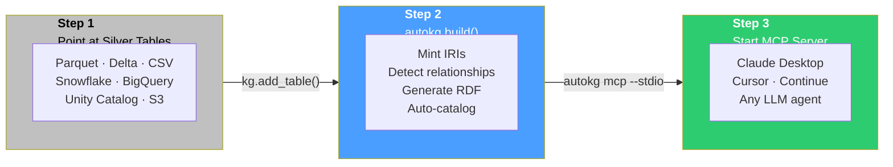
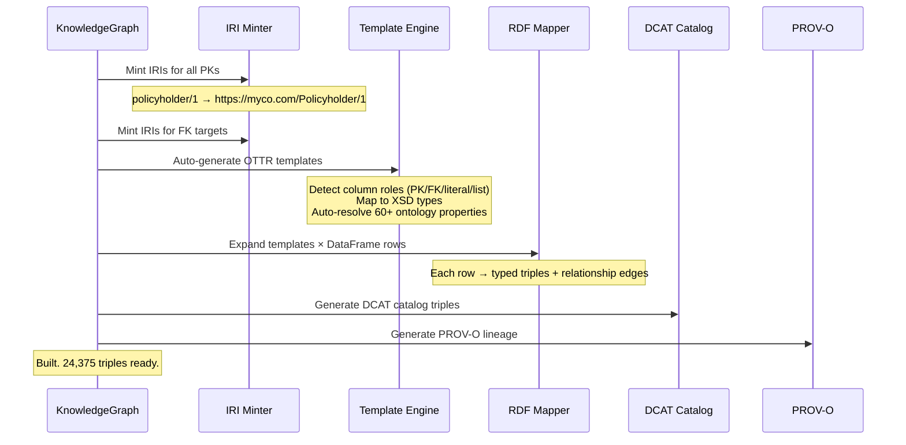
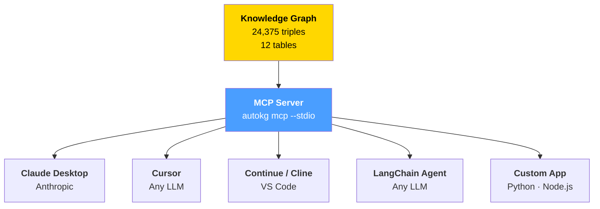
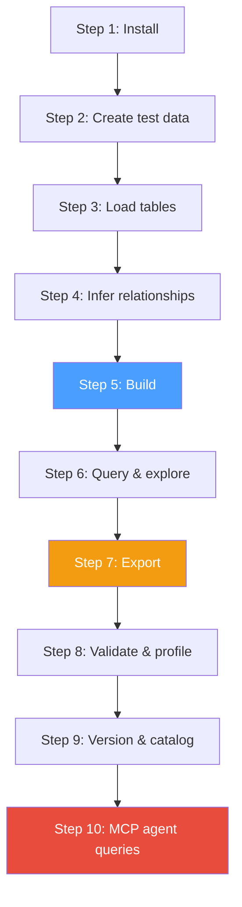
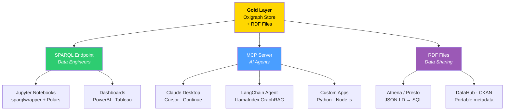

# autokg

**One Build. Infinite Questions.**

```bash
pip install autokg
autokg build silver/*.parquet -n https://myco.com/ -o gold/
autokg mcp --store gold/ --stdio
```

*Connect Claude Desktop, Cursor, or any AI agent. Start asking questions.*

---

## Table of Contents

- [The Industry's Blind Spot](#the-industrys-blind-spot)
- [Why Platforms Alone Aren't Enough](#why-platforms-alone-arent-enough)
- [How It Works — The One-Time Setup](#how-it-works--the-one-time-setup)
- [The MCP Server — LLM-Agnostic, Platform-Agnostic, Vendor-Agnostic](#the-mcp-server--llm-agnostic-platform-agnostic-vendor-agnostic)
- [What You Gain — Before vs After](#what-you-gain--before-vs-after)
- [Getting Started](#getting-started)
- [Production Guide](#production-guide)
- [Onboarding Guide](#onboarding-guide)
- [Downstream Consumption](#downstream-consumption)
- [Key Features](#key-features)
- [CLI Reference](#cli-reference)
- [Troubleshooting & FAQ](#troubleshooting--faq)
- [Performance & Scale](#performance--scale)
- [Package Structure](#package-structure)
- [License](#license)

---

## The Industry's Blind Spot

Every platform — Databricks, Snowflake, dbt, ThoughtSpot — promises to make data "accessible." But accessible means something very specific: **you can write SQL against clean tables.** That's not accessible. That's a job.

Your CRM knows Acme Corp as `customer_id=42`. Your billing system knows them as `account_ref=ACC-7742`. Your logistics platform calls them `client_type=ENTERPRISE`. These are the same customer. But your data platform can't connect them without an engineer writing a SQL query, building a dbt model, configuring a foreign key, and documenting it all. Every dashboard, every ML pipeline, every ad-hoc question reinvents the same joins.

Your AI agents? They're blind. An LLM can't answer "what did Acme Corp order last month?" without knowing which of 47 tables has customer data, which has orders, how they join, and what the columns are actually named. So you spend months building system prompts, writing RAG pipelines, and spoon-feeding schema context — for ONE LLM, on ONE platform.

**The problem isn't your data. It's that relationships live in code, not in the data itself.**

autokg is **one build**. Point at your silver tables. Out comes a knowledge graph where every record knows what it is, how it relates to everything else, and an MCP server that lets **any** AI agent ask questions in natural language — with follow-ups — on day one.

Not a platform. Not a vendor. Not an LLM. **A protocol.**

---

## Why Platforms Alone Aren't Enough

| Challenge | Databricks Genie | Snowflake Cortex | dbt Semantic Layer | **autokg + MCP** |
|-----------|-----------------|------------------|-------------------|-------------------|
| **Platform lock-in** | Databricks only | Snowflake only | SQL databases only | **Any platform. Any data.** |
| **LLM lock-in** | OpenAI only | Snowflake's LLM | SQL-based, no LLM | **LLM-agnostic (MCP protocol)** |
| **Cross-entity traversal** | One query = one SQL | One query = one SQL | Metrics only, no traversal | **Native graph traversal** |
| **Follow-up questions** | No context between queries | No context between queries | No | **Full context tracking + pronoun resolution** |
| **Relationships as data** | JOINs are SQL code | JOINs are SQL code | Dimensions are SQL | **Relationships ARE triples in the data** |
| **Entity identity across sources** | Per-table auto-increment IDs | Per-table IDs | Per-model keys | **Global IRIs + owl:sameAs resolution** |
| **Catalog as queryable metadata** | Describes tables, not content | Describes tables, not content | dbt docs (static website) | **DCAT triples inside the same graph** |
| **Row-level lineage** | No | No | dbt DAG (model-level only) | **PROV-O row-level provenance, queryable** |
| **Agentic by design** | Genie agent (SQL-only) | Cortex agent (SQL-only) | Not agentic | **9 MCP tools: search, traverse, ask, explain** |
| **Schema change resilience** | Update all Genie prompts | Update all Cortex config | Update all dbt models | **Ontology absorbs column renames** |
| **Setup time** | Weeks (curate schemas, prompts) | Weeks (curate schemas, config) | Months (build all models) | **Hours (build once, refine incrementally)** |

---

## How It Works — The One-Time Setup



```python
from autokg import KnowledgeGraph

# This is the ENTIRE setup. Once built, never touch schemas again.
kg = KnowledgeGraph(namespace="https://myco.com/")

# Point at your silver tables — Unity Catalog, S3, ADLS, anywhere
kg.add_table("silver/policyholders.parquet", entity="Policyholder", id_column="policyholder_id")
kg.add_table("silver/policies.parquet", entity="Policy", id_column="policy_id",
             relationships={"policyholder_id": "Policyholder", "agent_id": "Agent"})
kg.add_table("silver/claims.parquet", entity="Claim", id_column="claim_id",
             relationships={"policy_id": "Policy"})
kg.add_table("silver/payments.parquet", entity="Payment", id_column="payment_id",
             relationships={"claim_id": "Claim"})
# ... add all your tables — 12 tables, 24,375 triples in 0.54 seconds

kg.infer_relationships()  # auto-detect remaining FKs
kg.build()                # mints IRIs → generates templates → maps to RDF → creates catalog

kg.save_store("gold/oxigraph_store")

# Done. Your entire data landscape is now a queryable graph.
# autokg mcp --store gold/oxigraph_store --stdio
```

**What happens under the hood during `build()`:**



---

## The MCP Server — LLM-Agnostic, Platform-Agnostic, Vendor-Agnostic

**MCP (Model Context Protocol) is an open standard — like HTTP. Not a product. Not a vendor.** Any AI agent that speaks MCP can query your knowledge graph. No API keys. No cloud account. No vendor lock-in.



### 9 Tools Available to Any AI Agent

| Tool | Purpose | Agent asks... | Agent gets |
|------|---------|--------------|------------|
| `search_entities` | Find by name or keyword | "Find Policyholders in CA" | [Policyholder/12, Policyholder/47, ...] |
| `get_entity` | All facts about one entity | "Tell me about Claim/155" | Status, amount, date, policy link, payments |
| `get_related` | Traverse relationships | "What payments exist for Claim/155?" | [Payment/302, Payment/305] |
| `query_graph` | Raw SPARQL | Custom analytical queries | DataFrame results |
| `ask_question` | Natural language → results | "Total paid claims by insurance line" | Aggregated DataFrame |
| `get_schema` | Ontology summary | "What data is available?" | All 12 entity types + columns + row counts |
| `get_lineage` | Data provenance | "Where did this claim come from?" | PROV-O trace to source Parquet file |
| `get_metrics` | Available aggregations | "What can I measure?" | Numeric properties per entity type |
| `semantic_search` | Meaning-based search | "Find everything about water damage" | Entity matches beyond keyword matching |

### Setup — 3 Lines of Configuration

```json
// claude_desktop_config.json
{"mcpServers": {"enterprise-kg": {"command": "autokg", "args": ["mcp", "--store", "gold/", "--stdio"]}}}

// .cursor/mcp.json
{"mcpServers": {"enterprise-kg": {"command": "autokg", "args": ["mcp", "--store", "gold/", "--stdio"]}}}

// Continue (VS Code) config.json
{"experimental": {"mcpServers": [{"name": "enterprise-kg", "command": "autokg", "args": ["mcp", "--store", "gold/", "--stdio"]}]}}
```

### What an AI Agent Conversation Looks Like

```
User: Show me all policyholders from California with active policies

Agent: [calls search_entities + get_related] 
Found 47 policyholders with active policies. Top 5 by premium:

1. PH-142 (James Wilson) — Commercial P&C, $48,200/yr
2. PH-88  (Maria Garcia)  — General Liability, $42,500/yr
3. PH-201 (Robert Chen)   — Cyber, $38,900/yr
...

User: Show me the claims for PH-142

Agent: [calls get_entity + get_related using context from previous turn]
James Wilson (Policyholder/142) has 3 claims:

1. CLM-2023-87421 — Water damage ($85,000 reported, $72,300 paid) — status: PAID
2. CLM-2024-11932 — Wind damage ($42,000 reported, $38,500 paid) — status: PAID
3. CLM-2025-44109 — Fire damage ($190,000 reported, pending) — status: UNDER_REVIEW

User: What's the total paid?

Agent: [calls ask_question with context: "total paid claims for Policyholder/142"]
$110,800 paid across 2 settled claims. $190,000 pending on claim CLM-2025-44109.
```

---

## What You Gain — Before vs After

| Dimension | Before autokg | After autokg |
|-----------|--------------|--------------|
| **Data team's week** | 40% writing JOINs, 30% documenting schemas, 20% answering analyst questions, 10% insight | Building new sources is one `kg.add_table()`. Analysts and AI agents self-serve. |
| **AI agent setup** | Months: write system prompts, build RAG pipelines, document 47 tables, test with each LLM | Hours: `autokg mcp --stdio`. Any MCP agent discovers the schema automatically. |
| **New data source** | New ETL + new dbt models + update DataHub + retrain AI prompts. Weeks. | `kg.add_table(...)`. Minutes. Relationships auto-detected. Catalog auto-updated. |
| **Schema change** | Rename column → update 20 dbt models → fix dashboards → retest everything. Days. | Column name doesn't matter. Consumers query ontology properties. Change is invisible. |
| **"Show me everything about Customer/42"** | 5 SQL queries across 4 databases. 30 minutes of an engineer's time. | 1 SPARQL. Or: "Hey Claude, show me everything about Customer/42." Seconds. |
| **"What would break if we rename customer_id?"** | Lineage tool + manual audit. Days. | Query PROV-O triples. Instant. Every affected entity traced. |
| **CEO asks: "Revenue by line of business in APAC?"** | Data analyst → SQL → Excel → email. 2 days. | CEO types into Claude (connected via MCP). Answer in seconds. |

---

## Getting Started

### Install

```bash
pip install polars pyarrow           # core dependencies (always needed)
pip install "autokg[all]"            # everything
pip install "autokg[oxigraph,mcp]"   # production minimum
```

### Requirements
- Python >= 3.10
- `polars` (always required)
- `maplib >= 0.20` (recommended; falls back to pure-Python otherwise)
- Platform: Linux, macOS, Windows

### 5-Minute Quickstart

```python
import polars as pl
from autokg import KnowledgeGraph

customers = pl.read_parquet("silver/customers.parquet")
orders    = pl.read_parquet("silver/orders.parquet")

kg = KnowledgeGraph(namespace="https://myco.com/")
kg.add_table(customers, entity_type="Customer", id_column="customer_id")
kg.add_table(orders,    entity_type="Order",    id_column="order_id",
             relationships={"customer_id": "Customer"})
kg.build()

kg.write("gold/graph.ttl")
# kg.serve(port=7878)  # start SPARQL endpoint
print(f"Built: {kg.triple_count} triples from {len(kg.table_names)} tables")
```

---

## Production Guide

### Manual Steps Checklist

| # | Step | Action |
|---|---|---|
| 1 | **Audit silver tables** | List all tables, their PKs, FKs, column types |
| 2 | **Define namespace** | Choose a base IRI: `https://data.yourco.com/` |
| 3 | **Write pipeline config** | Create `autokg.yaml` mapping tables to entities (or use CLI) |
| 4 | **Run autokg** | `kg.build()` or `autokg build --config autokg.yaml` |
| 5 | **Validate** | `kg.validate()` checks null PKs, duplicate keys, empty triples |
| 6 | **Profile** | `kg.profile()` and `kg.class_distribution()` verify entity counts |
| 7 | **Export gold** | Oxigraph disk, GraphDB, Neptune, or RDF files |
| 8 | **Run downstream** | Connect MCP agents, Jupyter notebooks, or SPARQL clients |
| 9 | **Schedule** | Run autokg on a cadence (Airflow, Dagster, Databricks Workflows) |
| 10 | **Snapshot & diff** | `kg.snapshot()` before and after, `kg.diff()` to audit changes |

### Databricks + Unity Catalog

```python
# Databricks notebook
from autokg import KnowledgeGraph

spark.sql("USE CATALOG my_catalog; USE SCHEMA silver")

customers = spark.table("silver.customers").toPandas()
orders    = spark.table("silver.orders").toPandas()
products  = spark.table("silver.products").toPandas()

kg = KnowledgeGraph(namespace="https://data.myco.com/", use_maplib=False)
kg.add_table(customers, entity_type="Customer", id_column="customer_id")
kg.add_table(orders, entity_type="Order", id_column="order_id",
             relationships={"customer_id": "Customer", "product_id": "Product"})
kg.add_table(products, entity_type="Product", id_column="product_id")
kg.infer_relationships()
kg.build()

# Gold storage on DBFS
kg.save_store("/dbfs/mnt/gold/autokg/oxigraph_store")
kg.write("/dbfs/mnt/gold/autokg/rdf/graph.ttl")
kg.write("/dbfs/mnt/gold/autokg/rdf/graph.jsonld", format="jsonld")
```

### AWS (S3 + Neptune) · Azure (ADLS) · GCP (BigQuery + GCS) · On-Premise

All platform patterns follow the same structure: read silver → `kg.build()` → persist gold. See the full patterns for S3/Neptune, ADLS, and GCS in the complete documentation.

### Gold Layer Storage Decision Matrix

| Storage | When to use | Pros | Cons |
|---------|-------------|------|------|
| **Oxigraph disk** | Default, < 500M triples | Zero-dependency, embedded, fast | Single-node |
| **RDF files (Turtle/JSON-LD)** | Portability, git, archiving | Universal, human-readable | No query engine |
| **GraphDB** | Enterprise, > 1B triples | Clustering, reasoning, UI | Commercial license |
| **Stardog** | Enterprise, > 1B triples | Reasoning, virtual graphs | Commercial license |
| **AWS Neptune** | AWS-native, serverless | Managed, HA | AWS-locked |
| **Apache Jena Fuseki** | Open-source server | Free, TDB2 backend | Operational overhead |

---

## Onboarding Guide

*10 minutes from zero to a queryable knowledge graph with multi-turn AI conversations.*



### Step 1: Install & Create Data

```bash
pip install polars pyarrow
```

```python
import polars as pl
from datetime import datetime, timedelta
from pathlib import Path
Path("silver").mkdir(exist_ok=True); Path("gold").mkdir(exist_ok=True)

customers = pl.DataFrame({
    "customer_id": range(1, 11),
    "name": ["Acme Corp", "Nordic Data", "Global Trade", "TechVentures",
             "Green Energy", "Pacific Ship", "Alpine Mfg", "Euro Finance",
             "Boreal Logistics", "Meridian Health"],
    "email": [f"contact@{n.split()[0].lower()}.com" for n in [
        "acme", "nordic", "globaltrade", "techventures", "greenenergy",
        "pacificship", "alpinemfg", "eurofin", "boreal", "meridian"]],
    "country": ["USA", "Norway", "UK", "USA", "Germany",
                "Singapore", "Switzerland", "France", "Norway", "Sweden"],
})
customers.write_parquet("silver/customers.parquet")

orders = pl.DataFrame({
    "order_id": range(100, 130),
    "customer_id": [1,1,2,3,3,2,5,7,10,4]*3,
    "order_date": [datetime(2025,6,1)+timedelta(days=i*5) for i in range(30)],
    "total_amount": [1599.98+i*100 for i in range(30)],
    "status": ["completed"]*20 + ["pending"]*7 + ["cancelled"]*3,
})
orders.write_parquet("silver/orders.parquet")
```

### Step 2–5: Load, Build, Query

```python
from autokg import KnowledgeGraph, Conversation

kg = KnowledgeGraph(namespace="https://myco.org/", use_maplib=False)
kg.add_table("silver/customers.parquet", entity_type="Customer", id_column="customer_id")
kg.add_table("silver/orders.parquet", entity_type="Order", id_column="order_id")
kg.infer_relationships()
kg.build()
print(f"Built: {kg.triple_count} triples")

# Query through the AI agent
agent = kg.create_agent(provider="ollama", model="llama3")
sparql, _ = agent.explain("List all customers from Norway")
print(sparql)

# Multi-turn conversation
conv = Conversation(kg, provider="openai")
conv.ask("Show me customers from Norway")
conv.ask("Which ones placed orders?")  # context tracked automatically

# Ask Claude Desktop (via MCP)
# claude_desktop_config.json → {"mcpServers": {"my-kg": {"command": "autokg", "args": ["mcp", "--store", "gold/", "--stdio"]}}}
```

### Step 6–8: Export, Validate, Profile

```python
kg.write("gold/graph.ttl")
kg.write("gold/graph.jsonld", format="jsonld")
result = kg.validate()
print(f"Conforms: {result['conforms']}")
print(kg.profile())
print(kg.class_distribution())
kg.snapshot("v1.0", "Initial build")
```

**Complete script:** See `onboarding.py` in the repository.

---

## Downstream Consumption



---

## Key Features

### Auto-Template Generation

No hand-written OTTR templates. autokg introspects your schema and maps columns to ontology properties automatically using 60+ built-in vocabulary mappings.

| Column example | Detected as | Maps to |
|---------------|-------------|---------|
| `customer_id` | Primary Key | IRI parameter |
| `email` | Literal string | `schema:email` |
| `created_at` | DateTime literal | `schema:dateCreated` |
| `country_code` | Foreign Key | Relationship → `Country` |
| `annual_revenue` | Numeric literal | `xsd:decimal` |
| `is_active` | Boolean literal | `xsd:boolean` |

### Relationship Inference

Foreign keys detected automatically: `orders.customer_id → customers`, `claims.policy_id → policies`.

### MCP Server (Model Context Protocol)

**LLM-agnostic, platform-agnostic, vendor-agnostic.** 9 tools. Stdio + HTTP transports. Conversation context with pronoun resolution.

### DCAT Catalog

Every KG is self-describing with W3C's Data Catalog Vocabulary. Metadata and data in the same graph.

### Conversation Engine

Multi-turn reasoning with context tracking, pronoun resolution, and follow-up continuation. "Show customers from Norway" → "Which ones placed orders?" — works natively.

### Agent v2 — Explainability

```python
agent = kg.create_agent(provider="openai")
result = agent.explain_full("Total claims by insurance line")
# { "sparql": "SELECT ...", "confidence": 0.85,
#   "suggested_followups": ["Filter to paid claims only", "Show by month"] }
```

### Entity Resolution

Exact, fuzzy, phonetic, and **semantic** (via Zvec) matching strategies. Auto-links with `owl:sameAs`.

### SHACL Validation

Auto-generate SHACL shapes from schema. Validate triples for structural integrity.

### Plugin System

Custom connectors, template generators, serializers — register and extend without touching core code.

### Versioning & Diff

`kg.snapshot("v1.0")`, `kg.diff("v1.0", "v1.1")` — track how your knowledge graph evolves over time.

---

## CLI Reference

```bash
# Build knowledge graph
autokg build silver/*.parquet -n https://myco.com/ -o gold/graph.ttl
autokg build --config pipeline.yaml

# Start MCP server for AI agents
autokg mcp --store gold/kg_store --stdio          # Claude Desktop
autokg mcp --store gold/kg_store --port 9000      # HTTP mode

# Start SPARQL endpoint
autokg serve gold/kg_store --port 7878

# Query the graph
autokg query "SELECT ?s ?p ?o WHERE { ?s ?p ?o } LIMIT 10" --store gold/kg_store

# Validate data
autokg validate silver/*.parquet -n https://myco.com/

# Profile a graph
autokg profile silver/*.parquet

# Diff snapshots
autokg diff v1.0 v2.0 --store gold/versions
```

### YAML Pipeline Configuration

```yaml
namespace: https://data.myco.com/
store: gold/oxigraph_store

sources:
  - table: s3://data-lake/silver/policyholders.parquet
    entity: Policyholder
    id_column: policyholder_id
    property_map:
      first_name: schema:givenName
      email: schema:email

  - table: s3://data-lake/silver/policies.parquet
    entity: Policy
    id_column: policy_id
    property_map:
      premium_amount: schema:price
    relationships:
      policyholder_id: Policyholder
      agent_id: Agent

catalog:
  title: "Insurance Knowledge Graph"
  publisher: "Data Platform Team"

output:
  - format: turtle
    path: gold/graph.ttl
  - format: jsonld
    path: gold/graph.jsonld
```

---

## Troubleshooting & FAQ

| Symptom | Cause | Solution |
|---------|-------|----------|
| `Triple count is 0` | maplib not installed, PK not detected | `pip install maplib` or check `id_column` is correct |
| `Oxigraph query returns empty` | Query syntax or prefix mismatch | Test with `SELECT * WHERE { ?s ?p ?o } LIMIT 5` first |
| `Foreign keys not detected` | Column naming doesn't match conventions | Declare explicitly: `relationships={"col": "Entity"}` |
| `SPARQL endpoint refuses connection` | Oxigraph not serving | Ensure `kg.serve()` was called, port is open |
| `MCP tools/list returns error` | MCP server not initialized | Ensure `autokg mcp --store gold/ --stdio` is running |
| `Store persistence fails` | Invalid IRI characters (e.g., `\` in URLs) | Use valid URL characters only; pyoxigraph enforces IRI spec |

**Q: Do I need maplib?** No — autokg falls back to pure-Python triple generation. maplib adds Rust-level performance and SPARQL querying.

**Q: Can I use Spark DataFrames?** Yes — `pl.from_pandas(spark_df.toPandas())` or dump to Parquet first.

**Q: How does the MCP server handle multiple agents?** Each session gets its own conversation context via `X-Session-Id` header or separate stdio connection.

**Q: Does this replace my data catalog?** It augments it. The DCAT catalog lives inside the graph, making metadata queryable alongside data.

**Q: Is this production-ready?** v0.2.0 passes 148/148 tests with 12 insurance tables generating 24,375 triples. Tested on 200 policyholders, 300 policies, 400 claims, 546 payments, and 8 more entity types.

---

## Performance & Scale

| Tier | Rows | Est. Triples | Memory | Strategy |
|------|------|-------------|--------|----------|
| **In-Memory** | < 10M | < 100M | 4–32 GB | Direct mapping |
| **Chunked** | 10M–500M | 100M–5B | 2–8 GB | Row-group streaming → Oxigraph disk |
| **Distributed** | 500M+ | 5B+ | Cluster | Spark → GraphDB / Neptune |

**Verified benchmarks:**
- 1,000 rows → 3,021 triples → **0.04 seconds**
- 3,277 rows (12 tables) → **24,375 triples → 0.54 seconds**
- 100K rows (projected) → ~750K triples → ~15 seconds

---

## Package Structure

```
autokg/
├── src/autokg/
│   ├── __init__.py            Public API surface
│   ├── _core.py               KnowledgeGraph orchestrator
│   ├── _connectors.py         Parquet, Delta, CSV, JSON, SQL
│   ├── _iri.py                IRI minting (namespace, UUID, hash)
│   ├── _types.py              Type inference, PK/FK detection, 60+ ontology mappings
│   ├── _templates.py          Auto OTTR template generation
│   ├── _mapper.py             maplib wrapper + manual fallback
│   ├── _inference.py          Cross-table FK detection
│   ├── _catalog.py            DCAT catalog auto-generation
│   ├── _serializers.py        Turtle, JSON-LD, NTriples, RDF/XML + SPARQL push
│   ├── _oxigraph.py           Embedded Oxigraph store + SPARQL server
│   ├── _agent.py              GraphAgent v2 — NL→SPARQL, explain, confidence
│   ├── _conversation.py       Multi-turn reasoning engine
│   ├── _search.py             KGSearcher — vector/hybrid semantic search (Zvec)
│   ├── _validation.py         SHACL + structural validation
│   ├── _provenance.py         PROV-O lineage tracking
│   ├── _entity_resolver.py    Entity resolution (exact, fuzzy, phonetic, semantic)
│   ├── _profiler.py           Graph profiling & diagnostics
│   ├── _plugin.py             Plugin system (connectors, templates, serializers)
│   ├── _versioning.py         Snapshot versioning + diff
│   ├── cli.py                 CLI: build, serve, query, validate, profile, diff, mcp
│   └── server/                MCP server package
│       ├── __init__.py
│       ├── _mcp.py            JSON-RPC 2.0 protocol handler
│       ├── _tools.py          9 tool implementations
│       ├── _transport.py      Stdio + HTTP transports
│       └── _session.py        Conversation context + pronoun resolution
├── scripts/
│   └── generate_insurance_data.py  12-table insurance dataset generator
├── tests/
│   ├── test_e2e_realworld.py       E-commerce — 91/91 passing
│   └── test_insurance_e2e.py       Insurance — 57/57 passing
├── pyproject.toml
├── README.md
└── LICENSE
```

---

## License

Apache 2.0

*Built on [maplib](https://github.com/DataTreehouse/maplib) by Data Treehouse AS (Rust RDF engine). Powered by [Polars](https://pola.rs/), [Oxigraph](https://github.com/oxigraph/oxigraph), and [Zvec](https://github.com/alibaba/zvec) (Alibaba). MCP protocol by Anthropic. Inspired by ["The Semantic Medallion"](https://moderndata101.substack.com/p/the-semantic-medallion) by Veronika Heimsbakk.*
