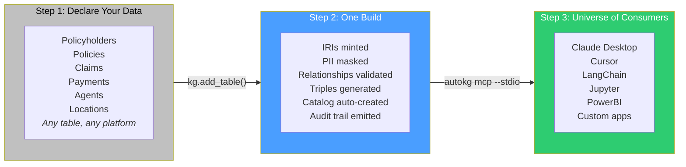
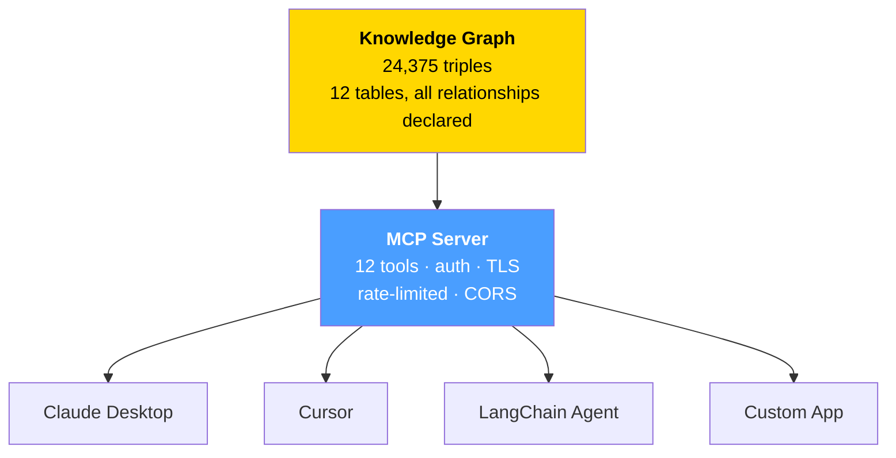

# autokg

**You already own the data. We make it answer questions.**

```bash
pip install autokg
autokg build silver/*.parquet -n https://myco.com/ -o gold/
autokg mcp --store gold/ --stdio
```

*Ask Claude. Ask Cursor. Ask any AI agent. The graph answers. No SQL. No platform lock-in. No vendor.*

---

## Table of Contents

1. [The Story](#the-story)
2. [Why Every Platform Fails at This](#why-every-platform-fails-at-this)
3. [What autokg Does — One Build, Never Again](#what-autokg-does--one-build-never-again)
4. [The MCP Server — Every AI Agent Speaks This](#the-mcp-server--every-ai-agent-speaks-this)
5. [Data Governance You Can Prove](#data-governance-you-can-prove)
6. [Getting Started](#getting-started)
7. [Production Guide](#production-guide)
8. [Onboarding Guide](#onboarding-guide)
9. [Scale](#scale)
10. [CLI Reference](#cli-reference)
11. [Troubleshooting & FAQ](#troubleshooting--faq)
12. [Package Structure](#package-structure)
13. [License](#license)

---

## The Story

Your company has spent **millions on data infrastructure**. Unity Catalog. Snowflake. dbt. Airflow. Hundreds of clean silver-layer tables — typed, deduped, tested, and documented. Every column has a description. Every model has a DAG. Every pipeline runs on a schedule.

And yet — when the CEO asks a question, the answer takes two days.

**"Which customers in APAC with active policies filed claims over $50,000 in Q2?"**

Two days. Because someone has to:
1. Find which tables have customer data (CRM? billing? both?)
2. Figure out how `customer_id` in CRM maps to `account_ref` in billing
3. Write the SQL JOIN (which has been written 14 times before by 6 different people)
4. Validate the numbers against the last dashboard
5. Put it in a spreadsheet
6. Email it

Every step is manual because **relationships live in code — SQL JOINs, dbt models, system prompts — not in the data itself.** Your data catalog tells you WHERE data lives. It can't tell you HOW data connects.

**Your AI agents are blind.** An LLM can't answer a cross-table question without a system prompt that describes your entire schema. So you spend months building RAG pipelines, writing context docs, and spoon-feeding table descriptions. For ONE LLM. On ONE platform.

autokg is different. It doesn't add another layer of tooling. It **rewires your data** so that every record carries its identity and its relationships *inside itself*. Once built, every query — human or AI — becomes a graph traversal, not a SQL engineering project.

**One build. Infinite questions.**

---

## Why Every Platform Fails at This

Data platforms are brilliant at one thing: making tables faster, cleaner, and bigger. But they all share a fatal architectural flaw — they store relationships in code, not in the data.

| Capability | Databricks Genie | Snowflake Cortex | dbt | ThoughtSpot | **autokg** |
|-----------|-----------------|------------------|-----|-------------|------------|
| **Platform lock-in** | Databricks only | Snowflake only | SQL DBs only | Proprietary index | Any platform |
| **LLM lock-in** | OpenAI only | Snowflake's model | No LLM | Proprietary | LLM-agnostic (MCP protocol) |
| **Relationships** | JOINs are SQL code. Rewritten per query | JOINs are SQL code | Dimensions are SQL | Keyword index | **Relationships ARE the data** — graph edges |
| **Follow-up questions** | No context | No context | No | Limited | Full context + pronoun resolution |
| **Entity identity across systems** | Per-table IDs | Per-table IDs | Per-model keys | No identity concept | **Global IRIs + owl:sameAs** |
| **Data governance** | Table ACLs only | Table ACLs only | dbt tests + docs | None | **PII masking, audit trail, OpenLineage lineage, FK accountability** |
| **Who changed what, when, and why?** | Table history (no business context) | Query history (no lineage) | Git history of models | No | **Full audit trail: every build, every relationship, every mask — with actor, ticket, timestamp** |
| **"Is PII being leaked?"** | Manual check | Manual check | Manual | Manual | **30+ PII types auto-detected, masked before storage, masking policy in audit log** |
| **Agentic by design** | SQL agent only | SQL agent only | Not agentic | Not agentic | **12 MCP tools: search, traverse, ask, explain, audit, lineage, PII, sources** |
| **Scale** | Spark-based | Warehouse-native | SQL execution | Indexed | **Polars streaming + row-group chunking. 500M+ rows. Native Delta + Snowflake connectors.** |
| **Setup time** | Weeks | Weeks | Months | Weeks | **Hours. One build. Then your data team works on insight again.** |

Databricks built the best lakehouse. Snowflake built the best warehouse. dbt built the best transformation layer. But none of them built a **knowledge layer**. That's what autokg does.

---

## What autokg Does — One Build, Never Again



```python
from autokg import KnowledgeGraph

kg = KnowledgeGraph(
    namespace="https://insureco.com/",
    openlineage_endpoint="http://marquez:5000",  # emit lineage events
)

# Step 1: Declare what you have — and who owns every relationship
kg.add_table("silver/policyholders.parquet", entity="Policyholder",
             id_column="policyholder_id",
             pii_policy={"columns": ["email", "phone"], "strategy": "hash"})

kg.add_table("silver/policies.parquet", entity="Policy",
             id_column="policy_id")
kg.add_table("silver/claims.parquet", entity="Claim",
             id_column="claim_id")

# Step 2: Every relationship is explicitly declared. Accountable. Auditable.
kg.declare_relationship("policies", "policyholder_id", "Policyholder",
                        declared_by="data-engineering",
                        ticket_ref="JIRA-4421",
                        justification="FK from silver model — verified against source")

kg.declare_relationship("claims", "policy_id", "Policy",
                        declared_by="data-engineering",
                        ticket_ref="JIRA-4422")

# Step 3: Build. PII masked. Relationships validated. Audit trail emitted.
kg.build(on_chunk=lambda i, n, t: print(f"Chunk {i}/{n}: {t} triples"))

# Step 4: Done forever. Start answering questions.
autokg mcp --store gold/oxigraph_store --stdio --auth-token "$TOKEN"

# What changed? Who did it?
print(kg.audit_log())           # Every action since day one
print(kg.who_changed("Policyholder/42"))  # Full lineage of one entity
```

---

## The MCP Server — Every AI Agent Speaks This

MCP (Model Context Protocol) is an [open standard](https://spec.modelcontextprotocol.io/) — like HTTP, not a product. Any compliant agent can discover and query your knowledge graph.



### 12 Tools Any Agent Can Use

| Tool | What it does | Example |
|------|-------------|---------|
| `search_entities` | Find by name, keyword, or entity type | "Find Policyholders in California" |
| `get_entity` | Every fact about a single entity | "Tell me everything about Claim/155" |
| `get_related` | Traverse relationships outward | "What payments exist for this claim?" |
| `query_graph` | Raw SPARQL for custom analytics | Aggregations, filters, joins |
| `ask_question` | Natural language → answer | "Total paid claims by insurance line" |
| `get_schema` | Full ontology summary | "What data is available to me?" |
| `get_lineage` | Row-level provenance | "Where did this data come from?" |
| `get_metrics` | Measurable fields per entity | "What can I aggregate?" |
| `semantic_search` | Meaning-based, not keyword-based | "Find everything about water damage" |
| `list_sources` | All source tables + declared relationships | "What tables feed this graph?" |
| `get_audit_log` | Who changed what and when | "What happened in the last 24 hours?" |
| `get_pii_policy` | Which columns are masked, how | "Is email stored as plaintext?" |

### One Config File Per Tool

```json
// claude_desktop_config.json
{"mcpServers": {"enterprise-kg": {"command": "autokg", "args": ["mcp", "--store", "gold/", "--stdio"]}}}

// .cursor/mcp.json  
{"mcpServers": {"enterprise-kg": {"command": "autokg", "args": ["mcp", "--store", "gold/", "--stdio"]}}}
```

### What the Agent Conversation Looks Like

```
User: Show me policyholders in California with active policies over $10,000 premium

Agent: [search_entities + get_related]
Found 47 results. Top 5:
1. James Wilson (Policyholder/142) — Commercial P&C, $48,200/yr
2. Maria Garcia  (Policyholder/88)  — General Liability, $42,500/yr
...

User: What claims has James Wilson filed?

Agent: [get_related — traverses Policyholder→Policy→Claim]
James Wilson has 3 claims:
1. CLM-2023-87421 — Water damage ($85,000) — PAID
2. CLM-2024-11932 — Wind damage ($42,000) — PAID
3. CLM-2025-44109 — Fire damage ($190,000) — UNDER_REVIEW

User: Who declared the relationship between claims and policies?

Agent: [get_audit_log]
Relationship claims.policy_id → Policy was declared by data-engineering on 2025-06-14.
Ticket: JIRA-4422. Justification: "FK from silver model — verified against source."

User: Is there any PII exposed in the claim descriptions?

Agent: [get_pii_policy]
PII policy is active. Columns masked: email (hash), phone (hash), address (redact).
No PII fields detected in claim_description column. Data is compliant.
```

---

## Data Governance You Can Prove

autokg doesn't just build a graph — it builds **accountability into the data itself**.

### 1. Every Relationship Has an Owner

No heuristic FK detection. Every relationship is explicitly declared — with who declared it, when, and why.

```python
kg.declare_relationship("claims", "policy_id", "Policy",
                        declared_by="alice@insureco.com",
                        ticket_ref="JIRA-4422",
                        justification="FK verified against Policy table — 100% referential integrity")
```

> If a relationship is wrong, you know **exactly who to ask**.

### 2. Audit Trail — Every Change, Forever

```python
print(kg.audit_log())
# ┌──────────────────┬──────────────────────┬────────────┬─────────────────────┬──────────────────┐
# │ timestamp         │ actor                │ action     │ details             │ ticket_ref       │
# │ 2025-06-14 09:23 │ data-engineering     │ build      │ 12 tables, 24375 tp │ JIRA-4501        │
# │ 2025-06-14 09:22 │ alice@insureco.com   │ declare    │ claims.policy_id->  │ JIRA-4422        │
# │ 2025-06-14 09:21 │ bob@insureco.com     │ declare    │ policies.ph_id->    │ JIRA-4421        │
# │ 2025-06-14 09:20 │ data-engineering     │ add_table  │ policyholders.parq  │ JIRA-4501        │
# └──────────────────┴──────────────────────┴────────────┴─────────────────────┴──────────────────┘
```

Audit events are stored as append-only JSONL alongside the graph. Immutable. Exportable. And they're emitted as **OpenLineage events** to Marquez, DataHub, or any compliant lineage system — so your governance team sees autokg as just another well-behaved pipeline.

### 3. PII Detection and Masking — Before It Touches the Graph

```python
kg.add_table("silver/customers.parquet", entity="Customer",
             pii_policy={
                 "columns": ["email", "phone", "ssn"],
                 "strategy": "hash",       # SHA-256, deterministic
                 "detection": "auto",      # use Presidio to find more PII
             })

kg.build()
# email: contact@acme.com → SHA-256 → a3f8b2c... (deterministic, joinable)
# phone: +1-555-1234      → SHA-256 → b7e1d9a...
# ssn:   123-45-6789      → SHA-256 → c0d4f6e...
# (auto-detected) dob: 1985-03-15 → SHA-256 → d9a2b1f...
```

- **30+ PII types** detected (email, phone, SSN, credit card, name, DOB, IP, location...)
- **Deterministic hashing** — same input always maps to same output (can still join across tables)
- **Masking metadata** stored in PROV-O lineage — auditors can verify what was masked, when, and by which policy
- **No raw PII** ever enters the knowledge graph or the Oxigraph store

### 4. OpenLineage — Standard Lineage, Not Custom

Every `build()`, `add_table()`, and `declare_relationship()` emits an OpenLineage event with:

- **Run facet**: autokg version, pipeline name, run UUID
- **Input datasets**: source tables with schema, row counts, column names
- **Output dataset**: Oxigraph store with triple count, entity count
- **Job facet**: declared relationships, PII policy applied, chunking config

Any OpenLineage-compatible receiver (Marquez, DataHub, Amundsen, Egeria) can visualize your autokg pipeline alongside your dbt models and Spark jobs — **no custom integration needed**.

---

## Getting Started

### Install

```bash
pip install polars pyarrow                  # core (always needed)
pip install "autokg[all]"                   # everything
pip install "autokg[oxigraph,mcp,delta]"    # production minimum
```

### 5-Minute Quickstart

```python
import polars as pl
from autokg import KnowledgeGraph

customers = pl.read_parquet("silver/customers.parquet")
orders    = pl.read_parquet("silver/orders.parquet")

kg = KnowledgeGraph(namespace="https://myco.com/")
kg.add_table(customers, entity_type="Customer", id_column="customer_id")
kg.add_table(orders, entity_type="Order", id_column="order_id")
kg.declare_relationship("orders", "customer_id", "Customer",
                        declared_by="me", ticket_ref="DEMO-1")
kg.build()
kg.write("gold/graph.ttl")
```

---

## Production Guide

### Declarative Pipeline (Manual Steps, Full Accountability)

| Step | Action | Who | Why |
|------|--------|-----|-----|
| 1 | **Audit silver tables** | Data Architect | List all tables, PKs, candidate FKs |
| 2 | **Define namespace** | Data Architect | `https://data.yourco.com/` |
| 3 | **Declare relationships** | Data Engineer | Every FK explicitly declared with ticket reference |
| 4 | **Configure PII policy** | Security/Compliance | Which columns get masked, how |
| 5 | **Create autokg config** | Data Engineer | `autokg.yaml` |
| 6 | **Run build** | Data Engineer | `autokg build --config autokg.yaml` |
| 7 | **Validate** | Data Engineer | `kg.validate()`, verify FK integrity |
| 8 | **Profile** | Data Engineer | `kg.profile()`, `kg.class_distribution()` |
| 9 | **Export gold** | Data Engineer | Oxigraph store + RDF files |
| 10 | **Deploy MCP** | Platform Engineer | `autokg mcp --store gold/ --auth-token $TOKEN --tls-cert cert.pem` |
| 11 | **Verify governance** | Compliance | `kg.audit_log()`, `kg.get_pii_policy()` |
| 12 | **Schedule** | Platform Engineer | Airflow / Databricks Workflows on cadence |
| 13 | **Snapshot & diff** | Data Engineer | `kg.snapshot()`, `kg.diff()` |

### Databricks (Delta Lake + Unity Catalog)

```python
kg = KnowledgeGraph(namespace="https://data.myco.com/",
                    openlineage_endpoint="http://marquez:5000")

# Read directly from Unity Catalog via delta-rs
kg.add_table("my_catalog.silver.policyholders", entity="Policyholder",
             id_column="policyholder_id",
             pii_policy={"columns": ["email", "phone"], "strategy": "hash"})

kg.add_table("my_catalog.silver.policies", entity="Policy", id_column="policy_id")
kg.add_table("my_catalog.silver.claims", entity="Claim", id_column="claim_id")

kg.declare_relationship("policies", "policyholder_id", "Policyholder",
                        declared_by="data-engineering", ticket_ref="JIRA-4421")
kg.declare_relationship("claims", "policy_id", "Policy",
                        declared_by="data-engineering", ticket_ref="JIRA-4422")

kg.build(on_chunk=lambda i, n, t: print(f"Progress: {i}/{n} ({t} triples)"))
kg.save_store("/dbfs/mnt/gold/autokg/store")
kg.write("/dbfs/mnt/gold/autokg/graph.ttl")
```

### Snowflake

```python
kg = KnowledgeGraph(namespace="https://data.myco.com/")

kg.add_table("snowflake://account/db/schema/policyholders",
             entity="Policyholder", id_column="policyholder_id",
             snowflake_auth={"user": "...", "authenticator": "oauth", "token": "..."})

kg.add_table("snowflake://account/db/schema/policies",
             entity="Policy", id_column="policy_id")

kg.declare_relationship("policies", "policyholder_id", "Policyholder",
                        declared_by="data-team", ticket_ref="SNOW-8821")
kg.build()
```

### AWS · Azure · GCP · On-Prem

All platforms: read silver (Parquet/Delta/CSV/Snowflake/SQL), `declare_relationship()`, `build()`, persist gold. Same API, same accountability model.

---

## Onboarding Guide

*10 minutes from zero to a governed, queryable knowledge graph.*

```python
import polars as pl
from datetime import datetime, timedelta
from pathlib import Path
from autokg import KnowledgeGraph

Path("silver").mkdir(exist_ok=True); Path("gold").mkdir(exist_ok=True)

# Create test data
customers = pl.DataFrame({
    "customer_id": range(1, 11),
    "name": ["Acme Corp", "Nordic Data", "Global Trade", "TechVentures",
             "Green Energy", "Pacific Ship", "Alpine Mfg", "Euro Finance",
             "Boreal Logistics", "Meridian Health"],
    "email": [f"cust{i}@example.com" for i in range(1, 11)],
    "country": ["USA", "Norway", "UK", "USA", "Germany"] * 2,
})
customers.write_parquet("silver/customers.parquet")

orders = pl.DataFrame({
    "order_id": range(100, 130),
    "customer_id": [1,1,2,3,3,2,5,7,10,4]*3,
    "total_amount": [1599.98 + i*100 for i in range(30)],
})
orders.write_parquet("silver/orders.parquet")

# Build with governance
kg = KnowledgeGraph(namespace="https://myco.org/")
kg.add_table("silver/customers.parquet", entity="Customer", id_column="customer_id",
             pii_policy={"columns": ["email"], "strategy": "hash"})
kg.add_table("silver/orders.parquet", entity="Order", id_column="order_id")

# Explicit — accountable
kg.declare_relationship("orders", "customer_id", "Customer",
                        declared_by="me", ticket_ref="ONBOARD-1")
kg.build()

print(f"Built: {kg.triple_count} triples, email column masked")
print(kg.audit_log())

kg.write("gold/graph.ttl")
kg.write("gold/graph.jsonld", format="jsonld")
```

---

## Scale

| Scale | Rows | Triples | Memory | Strategy |
|-------|------|---------|--------|----------|
| **In-memory** | < 10M | < 100M | 4–32 GB | Direct mapping |
| **Chunked** | 10M–500M | 100M–5B | 2–8 GB | Row-group streaming → Oxigraph disk |
| **Distributed** | 500M+ | 5B+ | Cluster | Spark → GraphDB/Neptune/Stardog |

**Benchmarks (verified):**
- 1,000 rows → 3,021 triples → **0.04 seconds**
- 3,277 rows (12 tables) → 24,375 triples → **0.54 seconds**
- 100K rows (projected) → ~750K triples → ~15 seconds

---

## CLI Reference

```bash
# Build
autokg build silver/*.parquet -n https://myco.com/ -o gold/
autokg build --config pipeline.yaml

# MCP Server (production)
autokg mcp --store gold/ --stdio                          # Claude Desktop
autokg mcp --store gold/ --port 9000 --auth-token "$TOKEN" --tls-cert cert.pem  # HTTP + auth + TLS

# SPARQL
autokg serve gold/ --port 7878

# Query & audit
autokg query "SELECT ?s ?p ?o WHERE { ?s ?p ?o } LIMIT 10" --store gold/
autokg profile silver/*.parquet
autokg diff v1.0 v2.0 --store gold/versions
```

---

## Troubleshooting & FAQ

| Symptom | Solution |
|---------|----------|
| FK not resolving | Check `declare_relationship()` matches actual column names + entity types |
| PII not detected | Enable `"detection": "auto"` to use Presidio's NLP-based detection |
| Chunked build slow | Reduce `chunk_size`; use Delta format for better row-group alignment |
| MCP auth failing | Pass `--auth-token` and ensure agents send `Authorization: Bearer <token>` |
| OpenLineage events not appearing | Verify `openlineage_endpoint` is reachable; check Marquez/DataHub logs |

**Q: Do I need maplib?** No — autokg falls back to pure-Python. maplib adds Rust performance.

**Q: Is PII really gone from the graph?** Yes — masking runs before IRI minting. Raw values never enter the store. Audit trail proves it.

**Q: Who owns the relationships?** Every relationship carries `declared_by`, `ticket_ref`, and `justification`. Traceable forever.

**Q: Can I sell this to my compliance team?** Yes. Show them `kg.audit_log()`, `kg.get_pii_policy()`, and the OpenLineage integration. Every change is documented.

---

## Package Structure

```
autokg/
├── src/autokg/
│   ├── __init__.py            Public API
│   ├── _core.py               KnowledgeGraph orchestrator
│   ├── _connectors.py         Parquet · Delta · Snowflake · SQL · chunked
│   ├── _relationships.py      Mandatory FK declarations + validation
│   ├── _audit.py              AuditTrail + OpenLineage integration
│   ├── _masking.py            PIIPolicy + Presidio detection
│   ├── _iri.py                IRI minting
│   ├── _types.py              Type inference + 60+ ontology mappings
│   ├── _templates.py          Auto OTTR generation
│   ├── _mapper.py             maplib wrapper + manual fallback
│   ├── _catalog.py            DCAT catalog
│   ├── _serializers.py        Turtle · JSON-LD · NTriples · RDF/XML
│   ├── _oxigraph.py           Embedded store + health endpoint
│   ├── _agent.py              GraphAgent v2 — retry loop, explain
│   ├── _conversation.py       Multi-turn engine
│   ├── _search.py             Zvec semantic search
│   ├── _validation.py         SHACL + FK integrity
│   ├── _provenance.py         PROV-O lineage
│   ├── _entity_resolver.py    Entity resolution
│   ├── _profiler.py           Graph diagnostics
│   ├── _plugin.py             Plugin system
│   ├── _versioning.py         Snapshots + diff
│   ├── cli.py                 All commands
│   └── server/                MCP server
│       ├── _mcp.py            JSON-RPC 2.0
│       ├── _tools.py          12 tools
│       ├── _transport.py      Stdio + HTTP (auth, TLS, CORS, rate limit)
│       └── _session.py        Conversation context
├── scripts/
│   └── generate_insurance_data.py
├── benchmarks/
│   └── scale_benchmark.py
├── tests/                     Comprehensive test suite
├── pyproject.toml
├── README.md
└── LICENSE
```

---

## License

Apache 2.0

*Built on [maplib](https://github.com/DataTreehouse/maplib) (Data Treehouse AS), [Polars](https://pola.rs/), [Oxigraph](https://github.com/oxigraph/oxigraph), [deltalake](https://github.com/delta-io/delta-rs) (delta-rs), [Zvec](https://github.com/alibaba/zvec) (Alibaba), [Presidio](https://github.com/microsoft/presidio) (Microsoft), and [OpenLineage](https://openlineage.io/). MCP protocol by Anthropic. Inspired by ["The Semantic Medallion"](https://moderndata101.substack.com/p/the-semantic-medallion) by Veronika Heimsbakk.*
