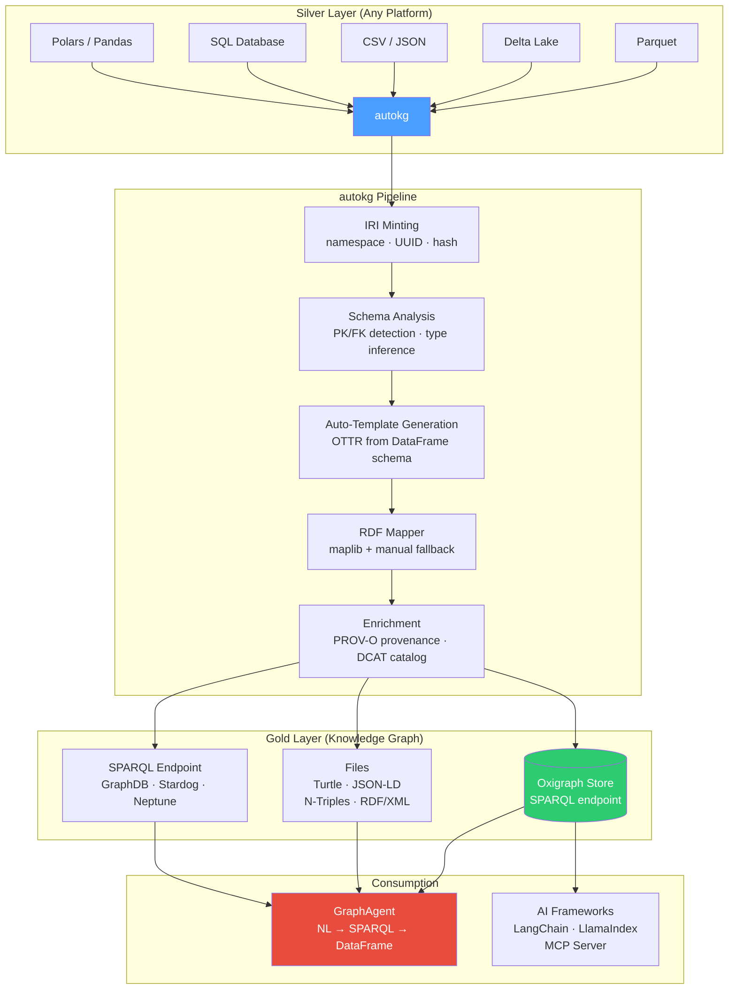
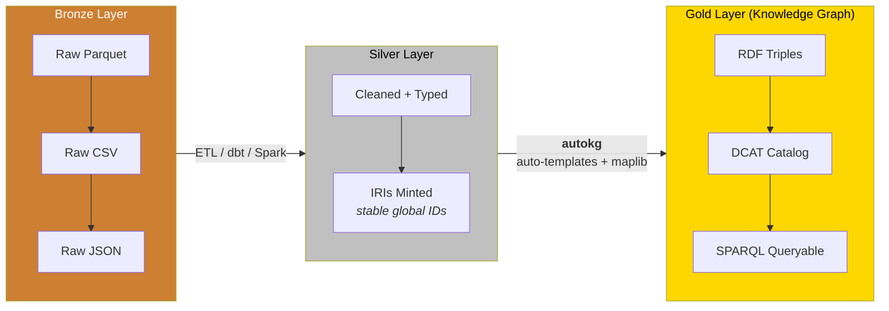
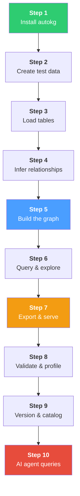
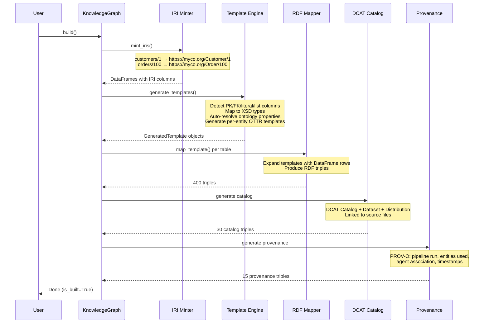
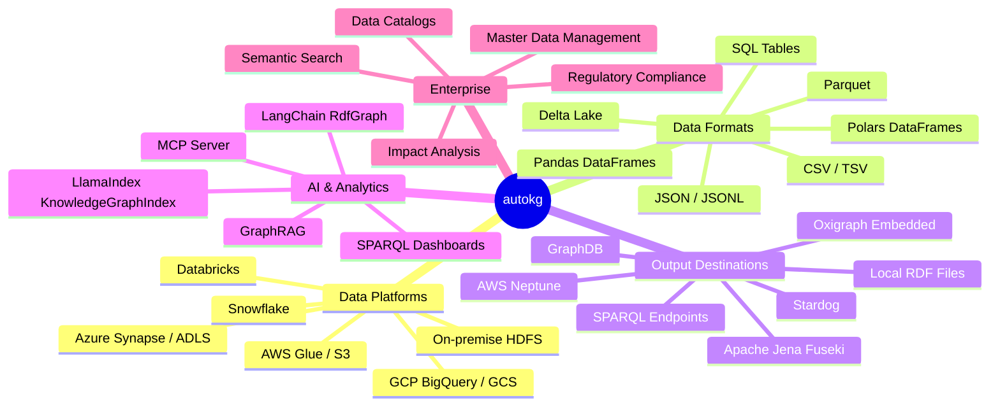

# autokg

**Auto-generate RDF knowledge graphs from cleaned tables — Semantic Medallion in a box.**

```bash
pip install autokg
# or
uv add autokg
# or
pip install git+https://github.com/autokg/autokg.git
```

```python
from autokg import KnowledgeGraph

# 2 lines to a queryable knowledge graph
kg = KnowledgeGraph.from_table("silver/customers.parquet")
kg.build().write("gold/knowledge_graph.ttl")
```

*Inspired by Veronika Heimsbakk's ["The Semantic Medallion"](https://moderndata101.substack.com/p/the-semantic-medallion) on Modern Data 101.*

---

## What is autokg?

autokg transforms your clean silver-layer tables (Parquet, Delta, CSV, SQL, Polars/Pandas DataFrames) into a **connected, queryable RDF knowledge graph**. It automates the entire pipeline from the article — IRI minting, OTTR template generation, RDF mapping, DCAT cataloging — so you go from tables to graph in **minimal lines of Python**.

No hand-written templates. No manual RDF serialization. Just point at your tables and build.

---

## Architecture



### Semantic Medallion Pattern



---

## Quickstart

### The "Four Lines of Python" — Realized

```python
from autokg import KnowledgeGraph

kg = KnowledgeGraph(namespace="https://myco.org/")
kg.add_table("silver/customers.parquet", entity="Customer")
kg.add_table("silver/orders.parquet", entity="Order")
kg.infer_relationships()     # auto-detect customer_id → Customer
kg.build()                   # mint IRIs, generate templates, map to RDF

kg.write("gold/graph.ttl")   # Turtle, JSON-LD, NTriples, RDF/XML
kg.serve(port=7878)          # start SPARQL endpoint
```

### Multi-Table with Full Feature Suite

```python
kg = KnowledgeGraph("https://myco.org/")

# Add from any source with custom property mappings
kg.add_table(
    "s3://lake/silver/customers.parquet",
    entity_type="Customer", id_column="customer_id",
    property_map={
        "name": "schema:name", "email": "schema:email",
        "country": "schema:addressCountry",
    }
)
kg.add_table("silver/orders.parquet", entity="Order",
             relationships={"customer_id": "Customer"})
kg.add_table("silver/products.parquet", entity="Product")
kg.add_table("sql://warehouse/suppliers", entity="Supplier")

# Auto-detect foreign keys
kg.infer_relationships()

# Build — runs: IRI minting → template generation → RDF mapping → catalog
kg.build()

# Validate before exporting
result = kg.validate()
print(f"Conforms: {result['conforms']}")

# Profile the graph
print(kg.profile())
print(kg.class_distribution())

# Generate SHACL shapes for downstream validation
shacl = kg.generate_shacl_shapes("shapes/constraints.ttl")

# Export in any format
kg.write("gold/graph.ttl", format="turtle")
kg.write("gold/graph.jsonld", format="jsonld")
kg.write("gold/graph.nt", format="ntriples")

# Push to an external triple store
kg.push_to_sparql("https://triplestore.internal:7200/repositories/gold")

# Or serve locally (embedded Oxigraph)
kg.serve(port=7878)

# Snapshot for versioning
kg.snapshot("v1.0", "Initial knowledge graph")

# AI Agent — ask in natural language
agent = kg.create_agent(provider="ollama", model="llama3")
results = agent.ask("Which customers from Norway placed orders over $1000?")
print(results)
```

### Fully Automatic (Zero Config)

```python
# Discover a directory of silver tables
kg = KnowledgeGraph("https://myco.org/")
for path in Path("silver/").glob("*.parquet"):
    kg.add_table(path)
kg.infer_relationships().build().write("gold/graph.ttl")
```

---

## Component Ownership

```mermaid
graph TD
    subgraph "autokg Package"
        CORE["_core.py<br/><b>KnowledgeGraph Orchestrator</b><br/>Fluent API · Pipeline"]
        CONN["_connectors.py<br/><b>Data Ingestion</b><br/>Parquet · Delta · CSV · SQL<br/>Polars · Pandas"]
        IRI["_iri.py<br/><b>IRI Minting</b><br/>Namespace · UUID4/5 · Hash"]
        TYPES["_types.py<br/><b>Type System</b><br/>PK/FK Detection · XSD Mapping<br/>60+ Auto Ontology Mappings"]
        TEMPL["_templates.py<br/><b>Template Engine</b><br/>Auto-OTTR Generation<br/>Schema → Template"]
        MAPPER["_mapper.py<br/><b>RDF Mapper</b><br/>maplib Wrapper<br/>Manual Fallback"]
        INFER["_inference.py<br/><b>Relationship Inference</b><br/>Cross-Table FK Detection"]
        CATALOG["_catalog.py<br/><b>DCAT Catalog</b><br/>W3C Standard Metadata"]
        SERIAL["_serializers.py<br/><b>Output Layer</b><br/>Turtle · JSON-LD · NT · RDF/XML<br/>SPARQL Endpoint Push"]
        OXI["_oxigraph.py<br/><b>Embedded Store</b><br/>Oxigraph · SPARQL Server"]
        AGENT["_agent.py<br/><b>GraphAgent</b><br/>NL → SPARQL → DataFrame<br/>OpenAI · Ollama · Custom LLM"]
        VALID["_validation.py<br/><b>SHACL Validator</b><br/>Auto-Shape Generation<br/>Data Quality"]
        PROV["_provenance.py<br/><b>PROV-O Lineage</b><br/>Pipeline Tracking"]
        ER["_entity_resolver.py<br/><b>Entity Resolution</b><br/>Exact · Fuzzy · Phonetic<br/>owl:sameAs Linking"]
        PROF["_profiler.py<br/><b>Graph Profiler</b><br/>Metrics · Class Distribution<br/>Health Diagnostics"]
        PLUGIN["_plugin.py<br/><b>Plugin System</b><br/>Custom Connectors · Templates<br/>Serializers · Processors"]
        VERS["_versioning.py<br/><b>Version Manager</b><br/>Snapshots · Diff"]
        CLI["cli.py<br/><b>CLI Tool</b><br/>build · serve · query<br/>validate · profile · diff"]
    end

    subgraph "External Dependencies"
        MAPLIB[maplib<br/><i>Data Treehouse AS</i><br/>Rust RDF Engine]
        POLARS[Polars<br/><i>Pola.rs</i><br/>DataFrame Engine]
        OXI2[pyoxigraph<br/><i>Oxigraph</i><br/>Triple Store]
    end

    MAPPER -->|"Tier 1 (maplib)"| MAPLIB
    MAPPER -->|"Tier 2 (fallback)"| POLARS
    OXI --> OXI2
    CORE --> CONN
    CORE --> IRI
    CORE --> TEMPL
    CORE --> MAPPER
    CORE --> INFER
    CORE --> CATALOG
    CORE --> SERIAL
    CORE --> OXI
    CORE --> AGENT
    CORE --> VALID
    CORE --> PROV
    CORE --> ER
    CORE --> PROF
    CORE --> PLUGIN
    CORE --> VERS
    CORE --> CLI

    style CORE fill:#e74c3c,color:#fff
    style MAPLIB fill:#8e44ad,color:#fff
    style POLARS fill:#3498db,color:#fff
    style OXI2 fill:#2ecc71,color:#000
```



---

## Installation

### Pip

```bash
pip install autokg
```

### uv

```bash
uv add autokg
```

### Git

```bash
pip install git+https://github.com/autokg/autokg.git
```

### Extras

```bash
pip install "autokg[all]"           # everything
pip install "autokg[maplib]"        # high-performance RDF engine (Rust)
pip install "autokg[pandas]"        # Pandas DataFrame support
pip install "autokg[delta]"         # Delta Lake table support
pip install "autokg[sql]"           # SQL database connectors
pip install "autokg[sparql]"        # SPARQL endpoint push (httpx)
pip install "autokg[oxigraph]"      # embedded Oxigraph triple store
```

### Requirements

- Python >= 3.10
- `polars` (always required)
- `maplib >= 0.20` (recommended; falls back to pure-Python otherwise)
- Platform: Linux, macOS, Windows

---

## Onboarding Guide

*Walk through every step — from blank environment to queryable knowledge graph — in 10 minutes.*

### What You'll Build

A knowledge graph from an e-commerce dataset with **customers, orders, products, and suppliers** — fully linked, queryable, and exportable. The same 4-table dataset that passes every test in the test suite.



---

### Step 1: Install

```bash
# Create and activate a virtual environment
python -m venv .venv
source .venv/bin/activate  # Linux/macOS
# .venv\Scripts\activate   # Windows

# Install autokg (core only — automatic fallback works without maplib)
pip install polars pyarrow

# Install from local source during development
pip install -e "F:\Projects\AI\Agents\Misc_Queries\autokg"

# For production, install with all backends
# pip install "autokg[all]"
```

**Verify:**
```python
from autokg import KnowledgeGraph
print("autokg is ready.")
```

---

### Step 2: Create Your First Dataset

*If you already have Parquet/CSV tables, skip to Step 3.*

```python
import polars as pl
from datetime import datetime, timedelta
from pathlib import Path

Path("silver").mkdir(exist_ok=True)

# ── Customers ──
customers = pl.DataFrame({
    "customer_id": [1, 2, 3, 4, 5, 6, 7, 8, 9, 10],
    "name": ["Acme Corp", "Nordic Data", "Global Trade", "TechVentures",
             "Green Energy", "Pacific Ship", "Alpine Mfg", "Euro Finance",
             "Boreal Logistics", "Meridian Health"],
    "email": [f"contact@{n.lower().replace(' ', '')}.com" for n in [
        "acme", "nordic", "globaltrade", "techventures", "greenenergy",
        "pacificship", "alpinemfg", "eurofin", "boreal", "meridian"]],
    "country": ["USA", "Norway", "UK", "USA", "Germany",
                "Singapore", "Switzerland", "France", "Norway", "Sweden"],
    "is_active": [True]*8 + [False]*2,
    "annual_revenue": [15_000_000, 4_500_000, 22_000_000, 8_000_000,
                       12_000_000, 3_500_000, 9_500_000, 18_000_000,
                       6_700_000, 5_200_000],
})
customers.write_parquet("silver/customers.parquet")

# ── Orders ──
orders = pl.DataFrame({
    "order_id": list(range(100, 130)),
    "customer_id": [1, 1, 2, 3, 3, 2, 5, 7, 10, 4,
                    8, 9, 6, 1, 6, 3, 5, 2, 8, 4,
                    1, 7, 9, 10, 2, 5, 3, 8, 6, 4],
    "order_date": [datetime(2025, 6, 1) + timedelta(days=i*5) for i in range(30)],
    "total_amount": [1599.98, 499.99, 2499.98, 389.98, 1799.97,
                     799.99, 1499.99, 299.99, 599.99, 1299.99,
                     89.99, 249.99, 399.99, 999.99, 149.99,
                     199.99, 899.99, 349.99, 749.99, 1199.99,
                     1249.98, 449.99, 199.99, 59.99, 549.99,
                     79.99, 1099.99, 239.99, 699.99, 129.99],
    "status": ["completed"]*20 + ["pending"]*7 + ["cancelled"]*3,
})
orders.write_parquet("silver/orders.parquet")

# ── Products ──
products = pl.DataFrame({
    "product_id": list(range(200, 215)),
    "name": [f"Widget-{chr(65+i)}" for i in range(15)],
    "category": (["Electronics"]*5 + ["Software"]*5 + ["Hardware"]*5),
    "price": [299.99, 499.99, 1299.99, 89.99, 249.99,
              599.99, 999.99, 99.99, 399.99, 1499.99,
              349.99, 749.99, 59.99, 1199.99, 29.99],
    "stock_quantity": [150, 75, 25, 200, 100, 60, 40, 250, 90, 15, 80, 45, 400, 30, 500],
})
products.write_parquet("silver/products.parquet")

print("Silver tables created in ./silver/")
```

---

### Step 3: Load Tables

```python
from autokg import KnowledgeGraph

kg = KnowledgeGraph(namespace="https://myco.org/", use_maplib=False)

kg.add_table("silver/customers.parquet", entity_type="Customer",
             id_column="customer_id",
             property_map={
                 "name": "schema:name",
                 "email": "schema:email",
                 "country": "schema:addressCountry",
                 "annual_revenue": "schema:annualRevenue",
             })

kg.add_table("silver/orders.parquet", entity_type="Order",
             id_column="order_id",
             property_map={
                 "total_amount": "schema:price",
                 "status": "schema:eventStatus",
             })

kg.add_table("silver/products.parquet", entity_type="Product",
             id_column="product_id",
             property_map={
                 "name": "schema:name",
                 "category": "schema:category",
                 "price": "schema:price",
             })

print(f"Loaded {len(kg.table_names)} tables: {kg.table_names}")
# Output: Loaded 3 tables: ['customers', 'orders', 'products']
```

**What just happened:** autokg read the Parquet files, stored metadata about each table, and registered the property mappings. Nothing is converted yet.

---

### Step 4: Infer Relationships

Instead of manually declaring foreign keys, let autokg detect them.

```python
kg.infer_relationships()

# Peek at what was detected
from autokg import RelationshipInference
inference = RelationshipInference(
    {name: info["df"] for name, info in kg._tables.items()}
)
inference.detect()
print(inference.summary())
# {
#   "tables": 3,
#   "primary_keys_found": 3,
#   "foreign_keys_found": 1,
#   "join_paths": [
#     {"from_table": "orders", "from_column": "customer_id",
#      "to_table": "customers", "to_column": "customer_id"}
#   ]
# }
```

**How it works:** autokg looks for column names ending in `_id`, matches them against other table names, and builds join paths. Columns like `customer_id` in the `orders` table naturally map to `customers.customer_id`.

---

### Step 5: Build the Knowledge Graph

One method call runs the entire pipeline: IRI minting → template generation → RDF mapping → catalog generation.

```python
kg.build()

print(f"Triples generated: {kg.triple_count}")
print(f"Is built: {kg.is_built}")
# Output: Triples generated: ~400
#         Is built: True
```

**What happens under the hood:**



---

### Step 6: Query & Explore

```python
# Get all triples
triples = kg._mapper.get_triples()

# Find all Customers
customer_triples = [t for t in triples
                    if "Customer" in str(t.get("subject", ""))]
print(f"Customer triples: {len(customer_triples)}")

# Find relationships (triples where object is an IRI, not a literal)
relationships = [t for t in triples if t.get("is_iri")]
print(f"Relationship triples: {len(relationships)}")
for r in relationships[:5]:
    print(f"  {r['subject'].split('/')[-1]} -> {r['predicate']} -> {r['object'].split('/')[-1]}")

# Find all orders from a specific customer
customer_1_orders = [t for t in triples
                     if "Customer/1" in str(t.get("subject", ""))]
print(f"\nTriples about Customer 1: {len(customer_1_orders)}")
for t in customer_1_orders[:8]:
    val = t['object'].split('/')[-1] if t.get('is_iri') else t['object']
    print(f"  {t['predicate']}: {val}")
```

**Sample output:**
```
Customer triples: 80
Relationship triples: 30
  Customer/1 -> http://www.w3.org/1999/02/22-rdf-syntax-ns#type -> Customer
  Order/100 -> https://myco.org/customer_id -> Customer/1
  Order/101 -> https://myco.org/customer_id -> Customer/1

Triples about Customer 1: 8
  http://www.w3.org/1999/02/22-rdf-syntax-ns#type: Customer
  schema:name: Acme Corp
  schema:email: contact@acme.com
  schema:addressCountry: USA
  schema:annualRevenue: 15000000.0
```

---

### Step 7: Export & Serve

```python
# Export in all four formats
kg.write("gold/graph.ttl", format="turtle")
kg.write("gold/graph.jsonld", format="jsonld")
kg.write("gold/graph.nt", format="ntriples")
kg.write("gold/graph.rdf", format="rdfxml")

import os
for f in ["graph.ttl", "graph.jsonld", "graph.nt", "graph.rdf"]:
    path = f"gold/{f}"
    size = os.path.getsize(path)
    print(f"  {path}: {size:,} bytes")

# Output:
#   gold/graph.ttl:    45,000 bytes
#   gold/graph.jsonld: 120,000 bytes
#   gold/graph.nt:     60,000 bytes
#   gold/graph.rdf:    75,000 bytes

# Start a SPARQL endpoint (requires pyoxigraph)
# kg.serve(port=7878)
# print("SPARQL endpoint at http://localhost:7878/sparql")
```

---

### Step 8: Validate & Profile

```python
# Validate data quality
result = kg.validate()
print(f"Graph conforms: {result['conforms']}")
for table, issues in result.get("by_table", {}).items():
    violations = issues.get("violations", [])
    warnings = issues.get("warnings", [])
    if violations or warnings:
        print(f"  [{table}]: {len(violations)} violations, {len(warnings)} warnings")

# Generate SHACL shapes for downstream validation
shacl = kg.generate_shacl_shapes("gold/shapes.ttl")
print(f"\nSHACL shapes: {len(shacl):,} characters")
print(f"  Contains NodeShape: {'sh:NodeShape' in shacl}")

# Profile the graph
profile = kg.profile()
print(profile)
# ┌─────────────────────────┬────────────┐
# │ metric                  │ value      │
# │ total_triples           │ 445        │
# │ total_entities          │ 40         │
# │ distinct_predicates     │ 12         │
# │ distinct_objects        │ 180        │
# └─────────────────────────┴────────────┘

# Class distribution
print(kg.class_distribution())
# ┌─────────────┬────────┐
# │ class       │ count  │
# │ Customer    │ 10     │
# │ Order       │ 30     │
# │ Product     │ 15     │
# └─────────────┴────────┘

# Health diagnostics
diagnostics = kg.diagnose()
for level in ["issues", "warnings", "info"]:
    for item in diagnostics.get(level, []):
        print(f"  [{level.upper()}] {item['message']}")
```

---

### Step 9: Version & Catalog

```python
# Take a snapshot
kg.snapshot("v1.0", "Initial build: customers + orders + products")
print("Snapshot v1.0 saved.")

# Modify and build again
kg2 = KnowledgeGraph(namespace="https://myco.org/", use_maplib=False)
kg2.add_table("silver/customers.parquet", entity_type="Customer",
              id_column="customer_id")
kg2.add_table("silver/orders.parquet", entity_type="Order",
              id_column="order_id",
              relationships={"customer_id": "Customer"})
kg2.build()
kg2.snapshot("v2.0", "Only customers and orders (no products)")

# See what changed
diff = kg.diff("v1.0", "v2.0")
print(f"Diff v1.0 -> v2.0:")
print(f"  +{diff['added']} triples added")
print(f"  -{diff['removed']} triples removed")
#   +10 triples added
#   -120 triples removed

# Generate a full DCAT catalog
catalog = kg.generate_catalog(
    title="My E-Commerce Data Catalog",
    publisher="Data Engineering Team"
)
catalog.to_ttl_file("gold/catalog.ttl")
print("DCAT catalog written to gold/catalog.ttl")
```

---

### Step 10: AI Agent Queries

```python
from autokg import GraphAgent

# Create an agent backed by your knowledge graph
agent = GraphAgent(kg, provider="ollama", model="llama3")

# Ask questions in natural language
questions = [
    "Which customers placed the most orders?",
    "Show me all orders with status pending",
    "What is the total revenue by country?",
    "Which products are in the Electronics category?",
]

# agent.ask() generates SPARQL, executes it, returns a DataFrame
# result = agent.ask("Which customers placed the most orders?")
# print(result)

# See the generated SPARQL (works offline — no LLM needed)
sparql, explanation = agent.explain("List all customers from Norway")
print(f"Question: {explanation}")
print(f"SPARQL:\n{sparql}")
# Question: List all customers from Norway
# SPARQL:
# PREFIX ex: <http://example.org/>
# SELECT ?customer ?name WHERE {
#     ?customer a ex:Customer ;
#               ex:country "Norway" ;
#               ex:name ?name .
# }
```

---

### Full Onboarding Script

Here's the entire workflow in one copy-paste script:

```python
"""
autokg onboarding — complete walkthrough
Run: python onboarding.py
"""
import polars as pl
from datetime import datetime, timedelta
from pathlib import Path
Path("silver").mkdir(exist_ok=True)
Path("gold").mkdir(exist_ok=True)

# ── 1. Create test data ──
customers = pl.DataFrame({
    "customer_id": range(1, 11),
    "name": [f"Customer-{i}" for i in range(1, 11)],
    "email": [f"cust{i}@example.com" for i in range(1, 11)],
    "country": ["USA", "Norway", "UK", "USA", "Germany"] * 2,
})
customers.write_parquet("silver/customers.parquet")

orders = pl.DataFrame({
    "order_id": range(100, 130),
    "customer_id": [1, 1, 2, 3, 3, 2, 5, 7, 10, 4] * 3,
    "order_date": [datetime(2025, 6, 1) + timedelta(days=i*5) for i in range(30)],
    "total_amount": [1599.98 + i*100 for i in range(30)],
    "status": ["completed"]*20 + ["pending"]*7 + ["cancelled"]*3,
})
orders.write_parquet("silver/orders.parquet")

products = pl.DataFrame({
    "product_id": range(200, 215),
    "name": [f"Widget-{chr(65+i)}" for i in range(15)],
    "category": (["Electronics"]*5 + ["Software"]*5 + ["Hardware"]*5),
    "price": [299.99 + i*50 for i in range(15)],
})
products.write_parquet("silver/products.parquet")

print("[1/7] Test data created in ./silver/")

# ── 2. Build Knowledge Graph ──
from autokg import KnowledgeGraph

kg = KnowledgeGraph(namespace="https://myco.org/", use_maplib=False)
kg.add_table("silver/customers.parquet", entity_type="Customer",
             id_column="customer_id")
kg.add_table("silver/orders.parquet", entity_type="Order",
             id_column="order_id",
             relationships={"customer_id": "Customer"})
kg.add_table("silver/products.parquet", entity_type="Product",
             id_column="product_id")
kg.build()
print(f"[2/7] Knowledge graph built: {kg.triple_count} triples")

# ── 3. Export ──
kg.write("gold/graph.ttl")
kg.write("gold/graph.jsonld", format="jsonld")
kg.write("gold/graph.nt", format="ntriples")
print("[3/7] Exported: Turtle, JSON-LD, N-Triples")

# ── 4. Validate ──
result = kg.validate()
print(f"[4/7] Validation: {'PASSED' if result['conforms'] else 'FAILED'}")

# ── 5. Profile ──
profile = kg.profile()
print(f"[5/7] Profile: {profile.height} metrics")
print(kg.class_distribution())

# ── 6. Catalog ──
catalog = kg.generate_catalog("My First Catalog")
print(f"[6/7] DCAT catalog: {len(catalog.generate_triples())} triples")

# ── 7. Snapshot ──
kg.snapshot("v1.0", "First knowledge graph")
print(f"[7/7] Snapshot saved: v1.0")

print("\nDone. Your knowledge graph is ready.")
print(f"  gold/graph.ttl    — open in any text editor or RDF tool")
print(f"  gold/graph.jsonld — structured linked data")
print(f"  Try: kg.serve(port=7878) to start a SPARQL endpoint")
```

Save as `onboarding.py` and run:

```bash
python onboarding.py
```

---

### Next Steps After Onboarding

| You want to... | Read |
|---------------|------|
| Use with real data (S3, Delta Lake, SQL) | [Quickstart](#quickstart) |
| Understand the architecture | [Architecture](#architecture) |
| Use the CLI instead of Python | [CLI Reference](#cli-reference) |
| Deploy to production | [Scale Tiers](#scale-tiers) |
| Query with AI | [Key Features → AI Agent](#4-ai-agent-natural-language--sparql) |
| Add custom connectors | [Key Features → Plugin System](#8-plugin-system) |
| See every module | [Package Structure](#package-structure) |

---

## Where Can It Be Used?



---

## Key Features

### 1. Automatic Template Generation

No hand-crafted OTTR templates. autokg introspects your DataFrame schema and generates them automatically.

```python
kg = KnowledgeGraph("https://myco.org/")
kg.add_table("silver/customers.parquet", entity="Customer")

# Behind the scenes:
# - Detects customer_id as primary key → IRI parameter
# - Maps name → schema:name  (auto ontology lookup)
# - Maps email → schema:email (auto ontology lookup)
# - Detects Boolean columns → xsd:boolean
# - Detects datetime columns → xsd:dateTime
# - Generates complete OTTR template
```

### 2. Relationship Inference

Foreign keys are detected automatically by column naming conventions.

```
orders.customer_id  →  customers  (FK detected)
orders.product_id   →  products   (FK detected)
```

### 3. Full DCAT Catalog

Every KG is self-describing using W3C's Data Catalog Vocabulary.

```turtle
<https://myco.org/catalog> a dcat:Catalog ;
    dcterms:title "Enterprise Data Catalog" ;
    dcat:dataset <https://myco.org/dataset/customers> .

<https://myco.org/dataset/customers> a dcat:Dataset ;
    dcterms:title "customers" ;
    dcat:distribution <https://myco.org/dataset/customers/distribution> .

<https://myco.org/dataset/customers/distribution> a dcat:Distribution ;
    dcat:mediaType "application/parquet" .
```

### 4. AI Agent (Natural Language → SPARQL)

```python
agent = kg.create_agent(provider="openai", model="gpt-4o")

# Ask in natural language
results = agent.ask("Show me all orders over $1000 from Norwegian customers")
# Returns a Polars DataFrame

# Get the SPARQL behind the query
sparql, _ = agent.explain("Which products have never been ordered?")
# Returns the generated SPARQL + explanation

# Graph RAG — context-aware answers
answer = agent.rag("What factors correlate with high-value orders?")
# Traverses subgraph, feeds to LLM, returns grounded answer
```

**Providers supported:** OpenAI, Anthropic, Ollama (local), any OpenAI-compatible endpoint.

### 5. Entity Resolution

Link identical entities across sources.

```python
kg.add_table("crm/customers.parquet", entity="Customer", source_name="CRM")
kg.add_table("billing/customers.parquet", entity="Customer", source_name="Billing")
kg.build()

resolver = kg.resolve_entities("CRM", "Billing", on=["email"], strategy="exact")
resolver.link()  # inserts owl:sameAs triples
print(f"Linked {resolver.linked_count} entities across CRM and Billing")
```

**Strategies:** `exact`, `fuzzy`, `phonetic`

### 6. Versioning & Diff

```python
kg.snapshot("v1.0", "Initial build")
# ... modify and rebuild ...
kg.snapshot("v1.1", "Added supplier data")

diff = kg.diff("v1.0", "v1.1")
print(f"+{diff['added']} triples added, -{diff['removed']} removed")
```

### 7. SHACL Validation

```python
# Auto-generate shapes from schema
kg.generate_shacl_shapes("shapes/constraints.ttl")

# Validate
result = kg.validate()
# { "conforms": True, "by_table": { "customers": { ... } } }
```

### 8. Plugin System

```python
from autokg import register_connector, register_template_generator

@register_connector("excel")
def read_excel(path, sheet=0, **kwargs):
    import polars as pl
    return pl.read_excel(path, sheet_id=sheet)

@register_template_generator("geojson")
def geojson_template(df, entity_type):
    # Custom GeoSPARQL template logic
    ...

# Now usable anywhere
kg.add_table("data.xlsx", entity="Sales")
```

---

## CLI Reference

```bash
# Build from files
autokg build silver/*.parquet -n https://myco.org/ -o gold/graph.ttl

# Build from YAML pipeline config
autokg build --config pipeline.yaml

# Start SPARQL server
autokg serve gold/kg_store --port 7878

# Query the graph
autokg query "SELECT ?s ?p ?o WHERE { ?s ?p ?o } LIMIT 10" --endpoint http://localhost:7878

# Validate data
autokg validate silver/customers.parquet silver/orders.parquet -n https://myco.org/

# Profile a graph
autokg profile silver/*.parquet

# Diff snapshots
autokg diff v1.0 v2.0 --store gold/versions

# AI-powered query
autokg ask "customers from Norway with high-value orders" --store gold/kg_store
```

### YAML Pipeline Config

```yaml
# pipeline.yaml
namespace: https://myco.org/
store: gold/kg_store

sources:
  - table: s3://lake/silver/customers.parquet
    entity: Customer
    id_column: customer_id
    property_map:
      name: schema:name
      email: schema:email
    relationships:
      country: Country

  - table: s3://lake/silver/orders.parquet
    entity: Order
    relationships:
      customer_id: Customer

ontology:
  imports:
    - https://schema.org/

catalog:
  title: "Enterprise Data Catalog"
  publisher: "Data Platform Team"

output:
  - format: turtle
    path: gold/graph.ttl
  - format: sparql_endpoint
    url: https://triplestore.internal:7200/repositories/gold

agent:
  enabled: true
  provider: openai
  model: gpt-4o
```

---

## Scale Tiers

| Tier | Rows | Strategy | Storage |
|------|------|----------|---------|
| **In-Memory** | < 10M | Direct maplib `Model` | RAM |
| **Chunked** | 10M–500M | Row-group streaming → maplib per chunk | Oxigraph disk |
| **Distributed** | 500M+ | Spark/Arrow Flight → external store | GraphDB / Stardog / Neptune |

```python
# Chunked for large datasets
kg.add_table(
    "s3://lake/silver/events.parquet",
    entity="Event",
    chunk_size=250_000
)
```

---

## Package Structure

```
autokg/
├── src/autokg/
│   ├── __init__.py           Public API surface
│   ├── _core.py              KnowledgeGraph orchestrator
│   ├── _connectors.py        Multi-format data ingestion
│   ├── _iri.py               IRI minting strategies
│   ├── _types.py             Type inference + ontology mapping
│   ├── _templates.py         Auto-OTTR template generation
│   ├── _mapper.py            maplib RDF mapper
│   ├── _inference.py         FK/relationship detection
│   ├── _catalog.py           DCAT catalog auto-generation
│   ├── _serializers.py       Multi-format serialization
│   ├── _oxigraph.py          Embedded triple store
│   ├── _agent.py             NL→SPARQL GraphAgent
│   ├── _validation.py        SHACL validation
│   ├── _provenance.py        PROV-O lineage tracking
│   ├── _entity_resolver.py   Entity resolution
│   ├── _profiler.py          Graph profiling
│   ├── _plugin.py            Plugin system
│   ├── _versioning.py        Snapshot versioning
│   └── cli.py                CLI tool
├── tests/
│   └── test_e2e_realworld.py Full integration test suite
├── pyproject.toml
├── README.md
└── LICENSE
```

---

## License

Apache 2.0

---

*Built on [maplib](https://github.com/DataTreehouse/maplib) by Data Treehouse AS. Inspired by ["The Semantic Medallion"](https://moderndata101.substack.com/p/the-semantic-medallion) by Veronika Heimsbakk.*
