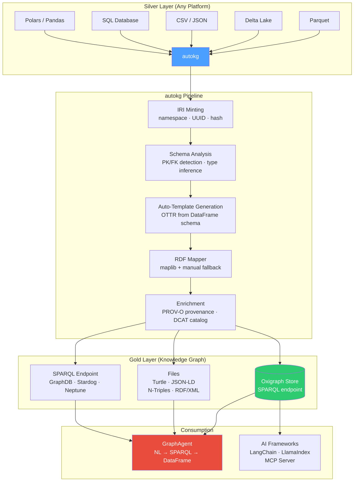
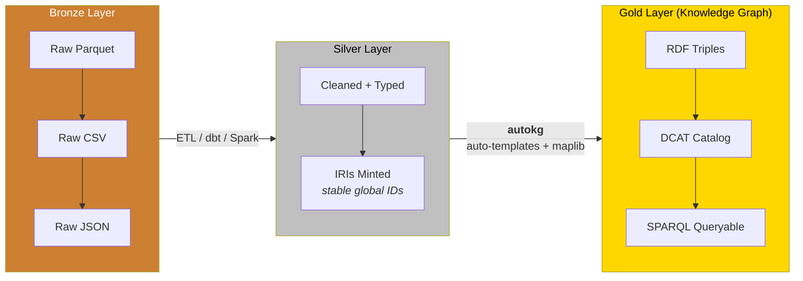
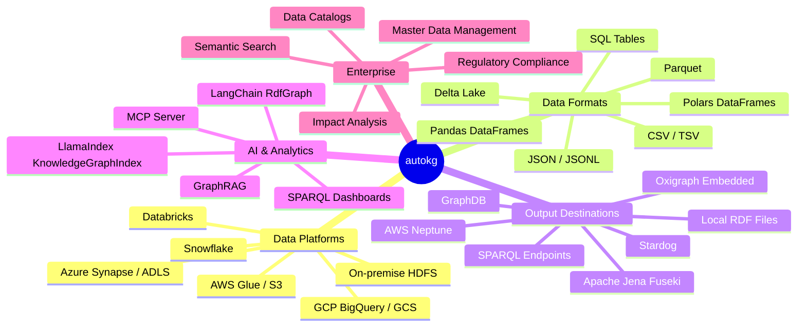

# autokg

**Auto-generate RDF knowledge graphs from cleaned tables — Semantic Medallion in a box.**

```bash
pip install autokg
# or
uv add autokg
# or
pip install git+https://github.com/autokg/autokg.git
```

```python
from autokg import KnowledgeGraph

# 2 lines to a queryable knowledge graph
kg = KnowledgeGraph.from_table("silver/customers.parquet")
kg.build().write("gold/knowledge_graph.ttl")
```

*Inspired by Veronika Heimsbakk's ["The Semantic Medallion"](https://moderndata101.substack.com/p/the-semantic-medallion) on Modern Data 101.*

---

## What is autokg?

autokg transforms your clean silver-layer tables (Parquet, Delta, CSV, SQL, Polars/Pandas DataFrames) into a **connected, queryable RDF knowledge graph**. It automates the entire pipeline from the article — IRI minting, OTTR template generation, RDF mapping, DCAT cataloging — so you go from tables to graph in **minimal lines of Python**.

No hand-written templates. No manual RDF serialization. Just point at your tables and build.

---

## Architecture



### Semantic Medallion Pattern



---

## Quickstart

### The "Four Lines of Python" — Realized

```python
from autokg import KnowledgeGraph

kg = KnowledgeGraph(namespace="https://myco.org/")
kg.add_table("silver/customers.parquet", entity="Customer")
kg.add_table("silver/orders.parquet", entity="Order")
kg.infer_relationships()     # auto-detect customer_id → Customer
kg.build()                   # mint IRIs, generate templates, map to RDF

kg.write("gold/graph.ttl")   # Turtle, JSON-LD, NTriples, RDF/XML
kg.serve(port=7878)          # start SPARQL endpoint
```

### Multi-Table with Full Feature Suite

```python
kg = KnowledgeGraph("https://myco.org/")

# Add from any source with custom property mappings
kg.add_table(
    "s3://lake/silver/customers.parquet",
    entity_type="Customer", id_column="customer_id",
    property_map={
        "name": "schema:name", "email": "schema:email",
        "country": "schema:addressCountry",
    }
)
kg.add_table("silver/orders.parquet", entity="Order",
             relationships={"customer_id": "Customer"})
kg.add_table("silver/products.parquet", entity="Product")
kg.add_table("sql://warehouse/suppliers", entity="Supplier")

# Auto-detect foreign keys
kg.infer_relationships()

# Build — runs: IRI minting → template generation → RDF mapping → catalog
kg.build()

# Validate before exporting
result = kg.validate()
print(f"Conforms: {result['conforms']}")

# Profile the graph
print(kg.profile())
print(kg.class_distribution())

# Generate SHACL shapes for downstream validation
shacl = kg.generate_shacl_shapes("shapes/constraints.ttl")

# Export in any format
kg.write("gold/graph.ttl", format="turtle")
kg.write("gold/graph.jsonld", format="jsonld")
kg.write("gold/graph.nt", format="ntriples")

# Push to an external triple store
kg.push_to_sparql("https://triplestore.internal:7200/repositories/gold")

# Or serve locally (embedded Oxigraph)
kg.serve(port=7878)

# Snapshot for versioning
kg.snapshot("v1.0", "Initial knowledge graph")

# AI Agent — ask in natural language
agent = kg.create_agent(provider="ollama", model="llama3")
results = agent.ask("Which customers from Norway placed orders over $1000?")
print(results)
```

### Fully Automatic (Zero Config)

```python
# Discover a directory of silver tables
kg = KnowledgeGraph("https://myco.org/")
for path in Path("silver/").glob("*.parquet"):
    kg.add_table(path)
kg.infer_relationships().build().write("gold/graph.ttl")
```

---

## Component Ownership

```mermaid
graph TD
    subgraph "autokg Package"
        CORE["_core.py<br/><b>KnowledgeGraph Orchestrator</b><br/>Fluent API · Pipeline"]
        CONN["_connectors.py<br/><b>Data Ingestion</b><br/>Parquet · Delta · CSV · SQL<br/>Polars · Pandas"]
        IRI["_iri.py<br/><b>IRI Minting</b><br/>Namespace · UUID4/5 · Hash"]
        TYPES["_types.py<br/><b>Type System</b><br/>PK/FK Detection · XSD Mapping<br/>60+ Auto Ontology Mappings"]
        TEMPL["_templates.py<br/><b>Template Engine</b><br/>Auto-OTTR Generation<br/>Schema → Template"]
        MAPPER["_mapper.py<br/><b>RDF Mapper</b><br/>maplib Wrapper<br/>Manual Fallback"]
        INFER["_inference.py<br/><b>Relationship Inference</b><br/>Cross-Table FK Detection"]
        CATALOG["_catalog.py<br/><b>DCAT Catalog</b><br/>W3C Standard Metadata"]
        SERIAL["_serializers.py<br/><b>Output Layer</b><br/>Turtle · JSON-LD · NT · RDF/XML<br/>SPARQL Endpoint Push"]
        OXI["_oxigraph.py<br/><b>Embedded Store</b><br/>Oxigraph · SPARQL Server"]
        AGENT["_agent.py<br/><b>GraphAgent</b><br/>NL → SPARQL → DataFrame<br/>OpenAI · Ollama · Custom LLM"]
        VALID["_validation.py<br/><b>SHACL Validator</b><br/>Auto-Shape Generation<br/>Data Quality"]
        PROV["_provenance.py<br/><b>PROV-O Lineage</b><br/>Pipeline Tracking"]
        ER["_entity_resolver.py<br/><b>Entity Resolution</b><br/>Exact · Fuzzy · Phonetic<br/>owl:sameAs Linking"]
        PROF["_profiler.py<br/><b>Graph Profiler</b><br/>Metrics · Class Distribution<br/>Health Diagnostics"]
        PLUGIN["_plugin.py<br/><b>Plugin System</b><br/>Custom Connectors · Templates<br/>Serializers · Processors"]
        VERS["_versioning.py<br/><b>Version Manager</b><br/>Snapshots · Diff"]
        CLI["cli.py<br/><b>CLI Tool</b><br/>build · serve · query<br/>validate · profile · diff"]
    end

    subgraph "External Dependencies"
        MAPLIB[maplib<br/><i>Data Treehouse AS</i><br/>Rust RDF Engine]
        POLARS[Polars<br/><i>Pola.rs</i><br/>DataFrame Engine]
        OXI2[pyoxigraph<br/><i>Oxigraph</i><br/>Triple Store]
    end

    MAPPER -->|"Tier 1 (maplib)"| MAPLIB
    MAPPER -->|"Tier 2 (fallback)"| POLARS
    OXI --> OXI2
    CORE --> CONN
    CORE --> IRI
    CORE --> TEMPL
    CORE --> MAPPER
    CORE --> INFER
    CORE --> CATALOG
    CORE --> SERIAL
    CORE --> OXI
    CORE --> AGENT
    CORE --> VALID
    CORE --> PROV
    CORE --> ER
    CORE --> PROF
    CORE --> PLUGIN
    CORE --> VERS
    CORE --> CLI

    style CORE fill:#e74c3c,color:#fff
    style MAPLIB fill:#8e44ad,color:#fff
    style POLARS fill:#3498db,color:#fff
    style OXI2 fill:#2ecc71,color:#000
```



---

## Installation

### Pip

```bash
pip install autokg
```

### uv

```bash
uv add autokg
```

### Git

```bash
pip install git+https://github.com/autokg/autokg.git
```

### Extras

```bash
pip install "autokg[all]"           # everything
pip install "autokg[maplib]"        # high-performance RDF engine (Rust)
pip install "autokg[pandas]"        # Pandas DataFrame support
pip install "autokg[delta]"         # Delta Lake table support
pip install "autokg[sql]"           # SQL database connectors
pip install "autokg[sparql]"        # SPARQL endpoint push (httpx)
pip install "autokg[oxigraph]"      # embedded Oxigraph triple store
```

### Requirements

- Python >= 3.10
- `polars` (always required)
- `maplib >= 0.20` (recommended; falls back to pure-Python otherwise)
- Platform: Linux, macOS, Windows

---

## Where Can It Be Used?



---

## Key Features

### 1. Automatic Template Generation

No hand-crafted OTTR templates. autokg introspects your DataFrame schema and generates them automatically.

```python
kg = KnowledgeGraph("https://myco.org/")
kg.add_table("silver/customers.parquet", entity="Customer")

# Behind the scenes:
# - Detects customer_id as primary key → IRI parameter
# - Maps name → schema:name  (auto ontology lookup)
# - Maps email → schema:email (auto ontology lookup)
# - Detects Boolean columns → xsd:boolean
# - Detects datetime columns → xsd:dateTime
# - Generates complete OTTR template
```

### 2. Relationship Inference

Foreign keys are detected automatically by column naming conventions.

```
orders.customer_id  →  customers  (FK detected)
orders.product_id   →  products   (FK detected)
```

### 3. Full DCAT Catalog

Every KG is self-describing using W3C's Data Catalog Vocabulary.

```turtle
<https://myco.org/catalog> a dcat:Catalog ;
    dcterms:title "Enterprise Data Catalog" ;
    dcat:dataset <https://myco.org/dataset/customers> .

<https://myco.org/dataset/customers> a dcat:Dataset ;
    dcterms:title "customers" ;
    dcat:distribution <https://myco.org/dataset/customers/distribution> .

<https://myco.org/dataset/customers/distribution> a dcat:Distribution ;
    dcat:mediaType "application/parquet" .
```

### 4. AI Agent (Natural Language → SPARQL)

```python
agent = kg.create_agent(provider="openai", model="gpt-4o")

# Ask in natural language
results = agent.ask("Show me all orders over $1000 from Norwegian customers")
# Returns a Polars DataFrame

# Get the SPARQL behind the query
sparql, _ = agent.explain("Which products have never been ordered?")
# Returns the generated SPARQL + explanation

# Graph RAG — context-aware answers
answer = agent.rag("What factors correlate with high-value orders?")
# Traverses subgraph, feeds to LLM, returns grounded answer
```

**Providers supported:** OpenAI, Anthropic, Ollama (local), any OpenAI-compatible endpoint.

### 5. Entity Resolution

Link identical entities across sources.

```python
kg.add_table("crm/customers.parquet", entity="Customer", source_name="CRM")
kg.add_table("billing/customers.parquet", entity="Customer", source_name="Billing")
kg.build()

resolver = kg.resolve_entities("CRM", "Billing", on=["email"], strategy="exact")
resolver.link()  # inserts owl:sameAs triples
print(f"Linked {resolver.linked_count} entities across CRM and Billing")
```

**Strategies:** `exact`, `fuzzy`, `phonetic`

### 6. Versioning & Diff

```python
kg.snapshot("v1.0", "Initial build")
# ... modify and rebuild ...
kg.snapshot("v1.1", "Added supplier data")

diff = kg.diff("v1.0", "v1.1")
print(f"+{diff['added']} triples added, -{diff['removed']} removed")
```

### 7. SHACL Validation

```python
# Auto-generate shapes from schema
kg.generate_shacl_shapes("shapes/constraints.ttl")

# Validate
result = kg.validate()
# { "conforms": True, "by_table": { "customers": { ... } } }
```

### 8. Plugin System

```python
from autokg import register_connector, register_template_generator

@register_connector("excel")
def read_excel(path, sheet=0, **kwargs):
    import polars as pl
    return pl.read_excel(path, sheet_id=sheet)

@register_template_generator("geojson")
def geojson_template(df, entity_type):
    # Custom GeoSPARQL template logic
    ...

# Now usable anywhere
kg.add_table("data.xlsx", entity="Sales")
```

---

## CLI Reference

```bash
# Build from files
autokg build silver/*.parquet -n https://myco.org/ -o gold/graph.ttl

# Build from YAML pipeline config
autokg build --config pipeline.yaml

# Start SPARQL server
autokg serve gold/kg_store --port 7878

# Query the graph
autokg query "SELECT ?s ?p ?o WHERE { ?s ?p ?o } LIMIT 10" --endpoint http://localhost:7878

# Validate data
autokg validate silver/customers.parquet silver/orders.parquet -n https://myco.org/

# Profile a graph
autokg profile silver/*.parquet

# Diff snapshots
autokg diff v1.0 v2.0 --store gold/versions

# AI-powered query
autokg ask "customers from Norway with high-value orders" --store gold/kg_store
```

### YAML Pipeline Config

```yaml
# pipeline.yaml
namespace: https://myco.org/
store: gold/kg_store

sources:
  - table: s3://lake/silver/customers.parquet
    entity: Customer
    id_column: customer_id
    property_map:
      name: schema:name
      email: schema:email
    relationships:
      country: Country

  - table: s3://lake/silver/orders.parquet
    entity: Order
    relationships:
      customer_id: Customer

ontology:
  imports:
    - https://schema.org/

catalog:
  title: "Enterprise Data Catalog"
  publisher: "Data Platform Team"

output:
  - format: turtle
    path: gold/graph.ttl
  - format: sparql_endpoint
    url: https://triplestore.internal:7200/repositories/gold

agent:
  enabled: true
  provider: openai
  model: gpt-4o
```

---

## Scale Tiers

| Tier | Rows | Strategy | Storage |
|------|------|----------|---------|
| **In-Memory** | < 10M | Direct maplib `Model` | RAM |
| **Chunked** | 10M–500M | Row-group streaming → maplib per chunk | Oxigraph disk |
| **Distributed** | 500M+ | Spark/Arrow Flight → external store | GraphDB / Stardog / Neptune |

```python
# Chunked for large datasets
kg.add_table(
    "s3://lake/silver/events.parquet",
    entity="Event",
    chunk_size=250_000
)
```

---

## Package Structure

```
autokg/
├── src/autokg/
│   ├── __init__.py           Public API surface
│   ├── _core.py              KnowledgeGraph orchestrator
│   ├── _connectors.py        Multi-format data ingestion
│   ├── _iri.py               IRI minting strategies
│   ├── _types.py             Type inference + ontology mapping
│   ├── _templates.py         Auto-OTTR template generation
│   ├── _mapper.py            maplib RDF mapper
│   ├── _inference.py         FK/relationship detection
│   ├── _catalog.py           DCAT catalog auto-generation
│   ├── _serializers.py       Multi-format serialization
│   ├── _oxigraph.py          Embedded triple store
│   ├── _agent.py             NL→SPARQL GraphAgent
│   ├── _validation.py        SHACL validation
│   ├── _provenance.py        PROV-O lineage tracking
│   ├── _entity_resolver.py   Entity resolution
│   ├── _profiler.py          Graph profiling
│   ├── _plugin.py            Plugin system
│   ├── _versioning.py        Snapshot versioning
│   └── cli.py                CLI tool
├── tests/
│   └── test_e2e_realworld.py Full integration test suite
├── pyproject.toml
├── README.md
└── LICENSE
```

---

## License

Apache 2.0

---

*Built on [maplib](https://github.com/DataTreehouse/maplib) by Data Treehouse AS. Inspired by ["The Semantic Medallion"](https://moderndata101.substack.com/p/the-semantic-medallion) by Veronika Heimsbakk.*
