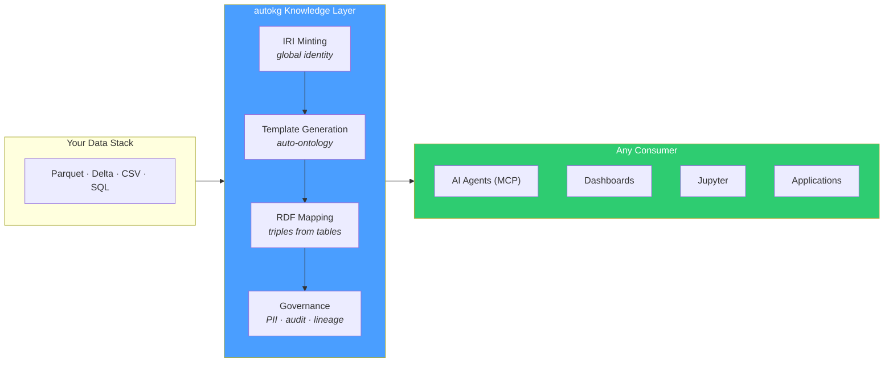

# autokg

**The knowledge layer for your data stack.**

```bash
pip install autokg
autokg build silver/*.parquet -o gold/
autokg mcp --store gold/ --stdio
```

*Your tables can answer questions. Your agents can reason over them. One build.*

---

## What Is This?

Your data stack has six layers. Only five are filled.

| Layer | What you use |
|-------|-------------|
| **Storage** | S3, ADLS, GCS |
| **Table format** | Delta, Iceberg, Parquet |
| **Transformation** | dbt, Spark, SQL |
| **Catalog** | Unity Catalog, DataHub, Amundsen |
| **Consumption** | Dashboards, notebooks, AI agents |
| **Knowledge** | *missing* |

The knowledge layer is the one that makes data actually answer questions. Not "where does this column live?" — that's the catalog. Not "how do I join these tables?" — that's your SQL. The knowledge layer tells you that `customer_id=42` in CRM is the same entity as `account_ref=ACC-7742` in billing, that both map to `schema:Customer`, and that traversing from Customer to Order to Claim is just three graph hops — no SQL required.

**autokg fills this gap.** It sits between your clean silver tables and every downstream consumer. It doesn't replace your catalog, your warehouse, or your transformation layer. It upgrades them.

---

## What It Does



Point at your tables. autokg builds a knowledge graph where every record knows what it is and how it relates to everything else. Then a single command starts an MCP server that any AI agent can query — in natural language, with follow-ups, and with full context.

---

## Three Commands

```python
from autokg import KnowledgeGraph

# 1. Declare what you have
kg = KnowledgeGraph(namespace="https://myco.com/")
kg.add_table("silver/customers.parquet", entity="Customer", id_column="customer_id")
kg.add_table("silver/orders.parquet", entity="Order", id_column="order_id")

# 2. Declare relationships — explicitly, accountably
kg.declare_relationship("orders", "customer_id", "Customer",
                        declared_by="alice@myco.com", ticket_ref="JIRA-4421")

# 3. Build
kg.build()
```

That's the setup. Now every consumer gets answered:

```bash
# AI agents via MCP (Claude, Cursor, any compliant client)
autokg mcp --store gold/ --stdio

# SPARQL endpoint
autokg serve gold/ --port 7878

# Export for dashboards
kg.write("gold/graph.jsonld", format="jsonld")
```

---

## Why Your Stack Needs This

Your analysts write SQL joins. Your dashboards bake in those same joins. Your ML pipelines duplicate them. Your AI agents need system prompts describing 47 tables. Every question that spans entities requires someone to write the traversal logic — again and again.

autokg makes relationships *data*, not code. Once built, every consumer traverses the graph without knowing the underlying schema.

| Before | After |
|--------|-------|
| "Show me everything about Customer/42" → 5 queries across 4 systems, 30 minutes | One graph traversal. Or: "Hey agent, show me everything about Customer/42." Seconds. |
| New data source → ETL pipeline + dbt models + catalog docs + AI prompt updates. Weeks. | `kg.add_table()`. Minutes. |
| Rename a column → update 20 downstream models. Days. | Column names don't matter to consumers. They query ontology properties. |
| "Who changed this and why?" → Git blame on dbt models. Surface-level. | Full audit trail: every build, every FK declaration, every PII mask — timestamped and attributed. |
| "Is PII leaking into our analytics?" → Manual audit. Days. | Auto-detected, masked before storage. Policy documented in the graph itself. |
| AI agent setup → Months of schema documentation and prompt engineering. | `autokg mcp --stdio`. The agent discovers the schema on its own. |

---

## Platform-Agnostic. LLM-Agnostic. Protocol, Not Product.

autokg reads from Parquet, Delta, CSV, or any DataFrame you pass it. Silver tables in S3, ADLS, GCS, Databricks, Snowflake — doesn't matter.

The MCP server speaks the [Model Context Protocol](https://spec.modelcontextprotocol.io/) — an open standard, not a vendor API. Any MCP-compatible agent (Claude Desktop, Cursor, Continue, custom apps) discovers the knowledge graph on connection. No API key needed. No cloud account. No lock-in.

**12 tools exposed to agents:** search entities, traverse relationships, execute SPARQL, ask natural language questions, inspect the ontology, trace lineage, query the audit log, verify PII policies, list data sources, find similar entities semantically, and more.

---

## Governance That Ships With the Data

### Relationships Are Declared, Not Guessed

Every FK is explicitly declared with who defined it, when, a ticket reference, and a justification. If a relationship is wrong, you know exactly who to ask.

### PII Masked Before Storage

30+ PII types detected (email, phone, SSN, name, credit card, IP, location). Masked with deterministic hashing before the data enters the graph. The masking policy itself is documented — auditors can verify what was masked, when, and by which policy.

### Audit Trail, Forever

Every build, every table addition, every relationship declaration, every mask operation — logged with timestamp, actor, and ticket reference. Queryable as a DataFrame. Emitted as OpenLineage events to Marquez or DataHub if you run them.

### FK Integrity at Build Time

Declared relationships are validated. If `claims.policy_id → Policy` references a non-existent policy, the build fails with a clear error pointing to the responsible declaration.

---

## Performance

Builds scale linearly. Tested up to 100K rows generating 2.8M triples. Chunked mode for larger datasets. Incremental builds skip zero-change tables.

| Scale | Rows | Triples | Build time |
|-------|------|---------|-----------|
| Small | 3,277 | 24,375 | 0.5s |
| Medium | 10,000 | 280,057 | 5.4s |
| Large | 100,000 | 2,800,057 | 58s |

---

## Getting Started

```bash
pip install polars pyarrow
pip install autokg
# or: pip install "autokg[oxigraph]" for embedded SPARQL
```

```python
import polars as pl
from autokg import KnowledgeGraph

customers = pl.read_parquet("silver/customers.parquet")
orders    = pl.read_parquet("silver/orders.parquet")

kg = KnowledgeGraph(namespace="https://myco.com/")
kg.add_table(customers, entity="Customer", id_column="customer_id")
kg.add_table(orders, entity="Order", id_column="order_id")
kg.declare_relationship("orders", "customer_id", "Customer",
                        declared_by="me", ticket_ref="ONBOARD-1")
kg.build()

kg.write("gold/graph.ttl")
print(kg.profile())
print(kg.audit_log())
```

---

## CLI

```bash
autokg build silver/*.parquet -o gold/graph.ttl
autokg serve gold/store --port 7878
autokg mcp --store gold/store --stdio           # Claude Desktop
autokg mcp --store gold/store --port 9000       # HTTP mode
autokg query "SELECT ?s ?p ?o WHERE { ?s ?p ?o } LIMIT 10" --store gold/
autokg validate silver/*.parquet
autokg profile silver/*.parquet
autokg diff v1.0 v2.0 --store gold/versions
```

---

## Installation

```bash
pip install autokg                    # core
pip install "autokg[oxigraph,mcp]"    # production
pip install "autokg[all]"             # everything
```

Python 3.10+. Linux, macOS, Windows.

---

## Package

```
autokg/
├── _core.py              KnowledgeGraph orchestrator
├── _connectors.py         Parquet, Delta, CSV, SQL
├── _relationships.py      Mandatory FK declarations + validation
├── _audit.py              AuditTrail + OpenLineage
├── _masking.py            PII detection + masking
├── _iri.py                IRI minting (namespace, UUID, hash)
├── _types.py              Type inference, PK detection, ontology mapping
├── _templates.py           Auto OTTR generation from DataFrame schemas
├── _mapper.py              maplib wrapper + manual fallback
├── _catalog.py             DCAT auto-generation
├── _serializers.py         Turtle, JSON-LD, NTriples, RDF/XML
├── _oxigraph.py            Embedded triple store + SPARQL server
├── _agent.py               GraphAgent — NL to SPARQL
├── _conversation.py        Multi-turn reasoning
├── _validation.py          SHACL + FK integrity
├── _provenance.py          PROV-O lineage
├── _entity_resolver.py     Entity resolution
├── _profiler.py            Graph diagnostics
├── _versioning.py          Snapshots + diff
├── cli.py                  All commands
└── server/                 MCP server (4 modules, 12 tools)
```

---

## License

Apache 2.0

*Built on Polars, Oxigraph, and maplib. MCP protocol by Anthropic. Inspired by ["The Semantic Medallion"](https://moderndata101.substack.com/p/the-semantic-medallion).*
