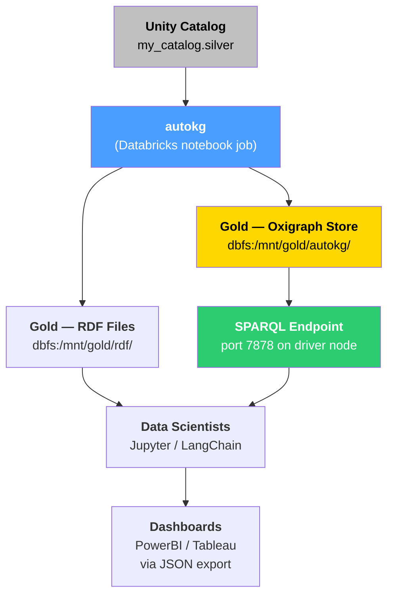
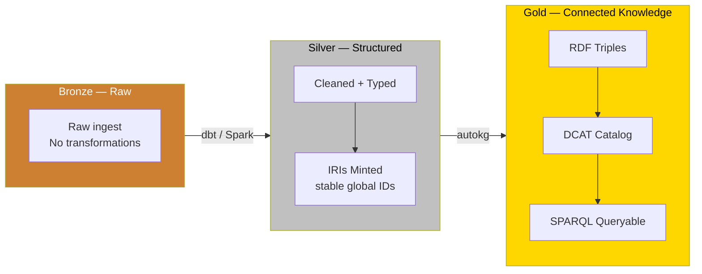
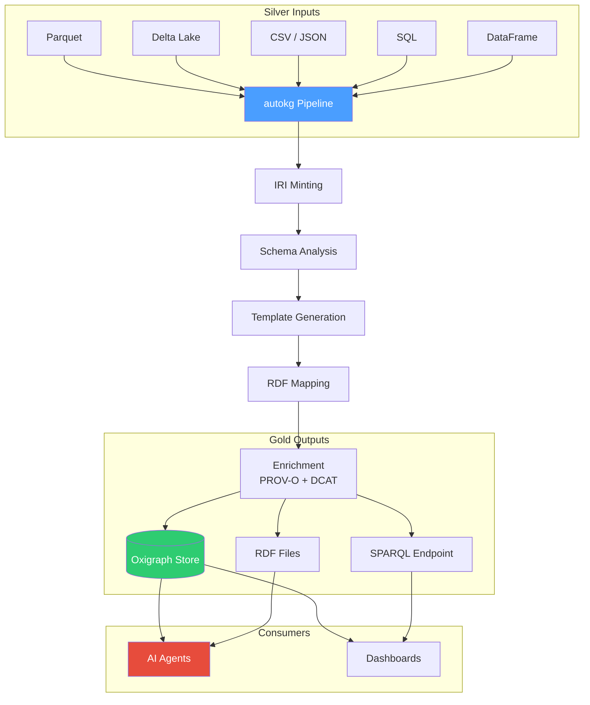
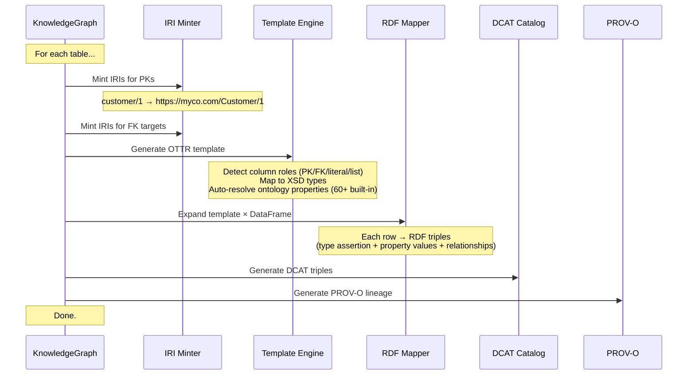
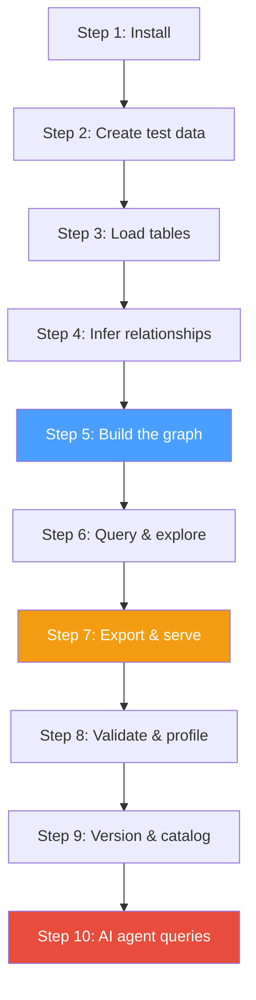
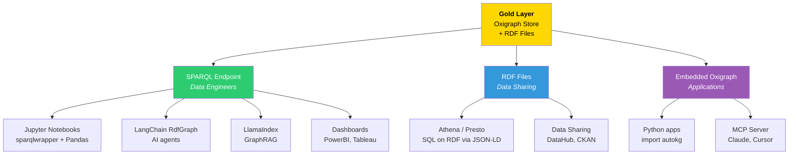

# autokg

**Auto-generate RDF knowledge graphs from cleaned tables — Semantic Medallion in a box.**

```bash
pip install autokg
```

```python
from autokg import KnowledgeGraph
kg = KnowledgeGraph.from_table("silver/customers.parquet")
kg.build().write("gold/knowledge_graph.ttl")
```

*Inspired by Veronika Heimsbakk's ["The Semantic Medallion"](https://moderndata101.substack.com/p/the-semantic-medallion).*

---

## Table of Contents

- [What Problem Does This Solve?](#what-problem-does-this-solve)
- [Getting Started](#getting-started)
- [Production Guide](#production-guide)
- [Architecture & Concepts](#architecture--concepts)
- [Onboarding Guide](#onboarding-guide)
- [Downstream Consumption](#downstream-consumption)
- [Key Features](#key-features)
- [CLI Reference](#cli-reference)
- [Troubleshooting & FAQ](#troubleshooting--faq)
- [Performance & Scale](#performance--scale)
- [Package Structure](#package-structure)
- [License](#license)

---

## What Problem Does This Solve?

Traditional medallion architectures stop at **Gold = clean Parquet tables**. To answer questions that span tables, you write joins. Lots of them. Every dashboard, every ML model, every ad-hoc query reinvents the relationships between your entities.

A **semantic gold layer** encodes those relationships into the data itself. Every record knows what it IS and how it RELATES to every other record — without SQL.

| | Traditional Gold | autokg Gold |
|---|---|---|
| **Data format** | Parquet / Delta tables | RDF triples inside Oxigraph / GraphDB / Neptune |
| **Relationships** | In your SQL joins | In the data (IRI → IRI edges) |
| **Entity identification** | Auto-increment IDs (per table) | Globally unique IRIs (across all systems) |
| **Cross-source queries** | ETL + join logic | Traverse the graph natively |
| **Catalog** | Separate tool (Amundsen, DataHub) | Part of the graph (DCAT) |
| **Query language** | SQL (point-to-point joins) | SPARQL (graph traversal) |
| **AI readiness** | Requires schema docs | Self-describing ontology + NL→SPARQL agent |

### When to use autokg

- You have 3+ related tables and want to stop writing the same joins over and over
- You need to link entities across different source systems (CRM, ERP, billing)
- You want AI agents to query your data without knowing the schema
- You're building a data catalog and want it to actually connect things
- You need lineage and provenance that's queryable, not just a static diagram
- You have a Unity Catalog / Databricks setup and want a semantic layer on top

---

## Getting Started

### Install

```bash
pip install polars pyarrow             # core dependencies
pip install "autokg[all]"              # everything (maplib, delta, sql, sparql, oxigraph)
pip install "autokg[maplib,oxigraph]"  # production minimum
```

### 5-Minute Quickstart

```python
import polars as pl
from autokg import KnowledgeGraph

# 1. Your silver data (from anywhere — Parquet, Delta, CSV, SQL, DataFrame)
customers = pl.read_parquet("silver/customers.parquet")
orders    = pl.read_parquet("silver/orders.parquet")
products  = pl.read_parquet("silver/products.parquet")

# 2. Build the knowledge graph
kg = KnowledgeGraph(namespace="https://myco.org/")
kg.add_table(customers, entity_type="Customer", id_column="customer_id")
kg.add_table(orders,    entity_type="Order",    id_column="order_id",
             relationships={"customer_id": "Customer"})
kg.add_table(products,  entity_type="Product",  id_column="product_id")
kg.build()  # mints IRIs → generates templates → maps to RDF → creates catalog

# 3. Export to gold layer
kg.write("gold/graph.ttl")              # RDF file (Turtle)
kg.serve(port=7878)                     # SPARQL endpoint
# kg.push_to_sparql("https://triplestore:7200/repositories/gold")  # external store

print(f"Built: {kg.triple_count} triples from {len(kg.table_names)} tables")
```

---

## Production Guide

This section covers real-world deployment: your data is in a platform like Databricks Unity Catalog, you need to run autokg as part of a pipeline, gold data must land in a specific location, and downstream consumers need documented access patterns.

### Manual Steps Checklist

Regardless of your platform, these are the steps you'll execute:

| # | Step | Action |
|---|---|---|
| 1 | **Audit silver tables** | List all tables, their PKs, FKs, column types |
| 2 | **Define namespace** | Choose a base IRI: `https://data.yourco.com/` |
| 3 | **Write pipeline config** | Create `autokg.yaml` mapping tables to entities |
| 4 | **Run autokg** | `kg.build()` or `autokg build --config autokg.yaml` |
| 5 | **Validate** | `kg.validate()` checks null PKs, duplicate keys |
| 6 | **Profile** | `kg.profile()` and `kg.class_distribution()` to verify entity counts |
| 7 | **Export gold** | Choose storage: Oxigraph disk, GraphDB, Neptune, or RDF files |
| 8 | **Run downstream** | Connect dashboards, AI agents, or SPARQL clients to the endpoint |
| 9 | **Schedule** | Run autokg on a cadence (Airflow, Dagster, Databricks Workflows) |
| 10 | **Snapshot & diff** | `kg.snapshot()` before and after, `kg.diff()` to audit changes |

### Platform-Specific Walkthroughs

#### Databricks + Unity Catalog

**Scenario:** You have a Unity Catalog schema `my_catalog.silver` with 12 tables. You want a semantic gold layer stored as an Oxigraph database in DBFS, with a SPARQL endpoint accessible to your data science team.



**Step-by-step:**

```python
# Databricks notebook: 01_build_knowledge_graph.py

from autokg import KnowledgeGraph

# 1. Read from Unity Catalog via spark.sql
#    Unity Catalog tables are accessible as: catalog.schema.table
spark.sql("USE CATALOG my_catalog")
spark.sql("USE SCHEMA silver")

customers = spark.table("silver.customers").toPandas()
orders    = spark.table("silver.orders").toPandas()
products  = spark.table("silver.products").toPandas()
# ... repeat for all 12 tables

# 2. Build knowledge graph
kg = KnowledgeGraph(namespace="https://data.myco.com/", use_maplib=False)

kg.add_table(customers, entity_type="Customer", id_column="customer_id",
             property_map={
                 "full_name": "schema:name",
                 "email_addr": "schema:email",
                 "country_code": "schema:addressCountry",
             })

kg.add_table(orders, entity_type="Order", id_column="order_id",
             relationships={"customer_id": "Customer", "product_id": "Product"})

# ... repeat for remaining tables

kg.infer_relationships()  # auto-detect any remaining FKs
print(f"Detected relationships: {kg._inference_result.summary()}")

kg.build()
print(f"Generated {kg.triple_count} triples")

# 3. Validate before committing to gold
result = kg.validate()
if not result["conforms"]:
    print("VALIDATION FAILED — check violations above")
    raise RuntimeError("Gold build failed validation")

# 4. Persist gold data to DBFS
gold_path = "/dbfs/mnt/gold/autokg/"

# Option A: Oxigraph store (queryable, persistent, SPARQL-ready)
kg.save_store(f"{gold_path}/oxigraph_store")

# Option B: RDF files for portability
kg.write(f"{gold_path}/rdf/knowledge_graph.ttl", format="turtle")
kg.write(f"{gold_path}/rdf/knowledge_graph.jsonld", format="jsonld")

# Option C: Both
kg.write(f"{gold_path}/rdf/knowledge_graph.nt", format="ntriples")

# 5. DCAT catalog (describes what's in the gold layer)
catalog = kg.generate_catalog(
    title="Enterprise Data Catalog — Semantic Gold Layer",
    publisher="Data Platform Team"
)
catalog_file = f"{gold_path}/rdf/catalog.ttl"
with open(catalog_file, "w") as f:
    f.write(catalog.to_ttl())

# 6. Snapshot
kg.snapshot("v1.0", f"Initial build from Unity Catalog my_catalog.silver — {kg.triple_count} triples")

print("Gold layer built successfully.")
print(f"  Oxigraph store: {gold_path}/oxigraph_store")
print(f"  RDF exports:    {gold_path}/rdf/")
print(f"  Catalog:        {catalog_file}")
```

**Where does the gold data live?**

| Artifact | Path | Format | Purpose |
|----------|------|--------|---------|
| Oxigraph store | `dbfs:/mnt/gold/autokg/oxigraph_store/` | Binary (B+tree) | SPARQL querying, incremental updates |
| Knowledge graph | `dbfs:/mnt/gold/autokg/rdf/graph.ttl` | Turtle | Portable, human-readable, git-friendly |
| Linked data | `dbfs:/mnt/gold/autokg/rdf/graph.jsonld` | JSON-LD | Web APIs, search indexing |
| DCAT catalog | `dbfs:/mnt/gold/autokg/rdf/catalog.ttl` | Turtle | Self-describing metadata |
| Snapshots | `dbfs:/mnt/gold/autokg/versions/` | JSON | Version history, diff support |

**Scheduling (Databricks Workflow):**

```yaml
# Databricks Job definition
name: autokg_gold_build
schedule: "0 6 * * *"  # daily at 6 AM
tasks:
  - task_key: build_knowledge_graph
    notebook_task:
      notebook_path: /Shared/autokg/01_build_knowledge_graph
    cluster:
      node_type_id: i3.xlarge
      num_workers: 2
    libraries:
      - pypi: { package: "autokg[all]" }
```

---

#### AWS (S3 + Glue + Neptune)

**Scenario:** Silver tables in S3 (`s3://data-lake/silver/`), gold graph pushed to Amazon Neptune, queries via SPARQL.

```python
kg = KnowledgeGraph(namespace="https://data.myco.com/")

# Read from S3
kg.add_table("s3://data-lake/silver/customers.parquet", entity="Customer")
kg.add_table("s3://data-lake/silver/orders.parquet", entity="Order")
kg.add_table("s3://data-lake/silver/products.parquet", entity="Product")

kg.infer_relationships()
kg.build()
kg.validate()

# Push to Neptune SPARQL endpoint
kg.push_to_sparql(
    "https://neptune-cluster.region.neptune.amazonaws.com:8182/sparql",
    graph_uri="https://data.myco.com/gold",
    auth=("username", "password")  # or use IAM via SigV4
)

# Also keep an Oxigraph backup on S3
kg.save_store("/tmp/oxigraph_store")
```

**Gold storage layout:**

| Artifact | Location | Purpose |
|----------|----------|---------|
| Live graph | Neptune cluster | Low-latency SPARQL queries |
| Backup | `s3://data-lake/gold/oxigraph/` | Disaster recovery |
| RDF export | `s3://data-lake/gold/rdf/` | Portability, Athena queries |
| Catalog | `s3://data-lake/gold/catalog.ttl` | Metadata |

---

#### Azure (ADLS + Synapse)

**Scenario:** Silver in ADLS Gen2, gold Oxigraph store on mounted storage, SPARQL served from a container.

```python
kg = KnowledgeGraph(namespace="https://data.myco.com/")

# ADLS paths (with abfss://)
kg.add_table("abfss://silver@datalake.dfs.core.windows.net/customers.parquet", entity="Customer")
kg.add_table("abfss://silver@datalake.dfs.core.windows.net/orders.parquet", entity="Order")

kg.infer_relationships()
kg.build()

# Store in ADLS gold container
kg.save_store("abfss://gold@datalake.dfs.core.windows.net/autokg/oxigraph_store")
kg.write("abfss://gold@datalake.dfs.core.windows.net/autokg/rdf/graph.ttl")

# For SPARQL: copy store to a VM or container, run `autokg serve`
# Or push to an Azure-hosted triple store
```

---

#### GCP (BigQuery + GCS)

**Scenario:** Silver tables in BigQuery, exported to Parquet in GCS, gold in Oxigraph.

```python
# Export BigQuery → Parquet (one-time or scheduled)
# bq extract --destination_format=PARQUET my_dataset.customers gs://bucket/silver/customers-*.parquet

kg = KnowledgeGraph(namespace="https://data.myco.com/")
kg.add_table("gs://bucket/silver/customers-*.parquet", entity="Customer")
kg.add_table("gs://bucket/silver/orders-*.parquet", entity="Order")
kg.build()

kg.save_store("gs://bucket/gold/autokg/oxigraph_store")
kg.write("gs://bucket/gold/autokg/graph.ttl")
```

---

#### On-Premise / Local

```python
# Silver from local Parquet files
kg = KnowledgeGraph(namespace="https://data.myco.com/")
for f in Path("/data/silver/").glob("*.parquet"):
    kg.add_table(f)
kg.infer_relationships()
kg.build()

# Gold on local disk
kg.save_store("/data/gold/oxigraph_store")
kg.write("/data/gold/graph.ttl")
kg.serve(port=7878)  # SPARQL: http://localhost:7878/sparql
```

---

### Gold Layer Storage Decision Matrix

| Storage | When to use | Pros | Cons |
|---------|-------------|------|------|
| **Oxigraph disk** | Default choice, < 500M triples | Zero-dependency, embedded, fast B+tree | Single-node |
| **RDF files (Turtle/JSON-LD)** | Portability, git, archiving | Universal, human-readable | No query engine |
| **GraphDB** | Enterprise, > 1B triples | Clustering, reasoning, UI | Commercial license |
| **Stardog** | Enterprise, > 1B triples | Reasoning, virtual graphs | Commercial license |
| **AWS Neptune** | AWS-native, serverless | Managed, HA, millisecond queries | AWS-locked, cost |
| **Apache Jena Fuseki** | Open-source server | Free, clustering, TDB2 backend | Operational overhead |

---

## Architecture & Concepts

### Semantic Medallion Pattern



### Pipeline — Inside autokg



### What Happens During `build()`



### IRI Minting Strategies

| Strategy | Example | When to use |
|----------|---------|-------------|
| `namespace` | `https://myco.com/Customer/42` | Human-readable, predictable |
| `uuid4` | `https://myco.com/Customer/a1b2c3d4-...` | No collision risk |
| `uuid5` | `https://myco.com/Customer/d3b0738...` | Deterministic from ID value |
| `hash` | `https://myco.com/Customer/2cf24db...` | Content-addressable |
| `numeric` | `https://myco.com/Customer/42` | Same as namespace, but for numeric IDs only |

```python
kg = KnowledgeGraph(namespace="https://myco.com/", iri_strategy="uuid5")
```

---

## Onboarding Guide

*10 minutes from zero to a queryable knowledge graph.*



### Step 1–2: Install & Create Data

```bash
pip install polars pyarrow
pip install -e "F:\Projects\AI\Agents\Misc_Queries\autokg"   # local dev
# pip install "autokg[all]"                                     # production
```

```python
import polars as pl
from datetime import datetime, timedelta
from pathlib import Path
Path("silver").mkdir(exist_ok=True); Path("gold").mkdir(exist_ok=True)

customers = pl.DataFrame({
    "customer_id": range(1, 11),
    "name": ["Acme Corp", "Nordic Data", "Global Trade", "TechVentures",
             "Green Energy", "Pacific Ship", "Alpine Mfg", "Euro Finance",
             "Boreal Logistics", "Meridian Health"],
    "email": [f"contact@{n.split()[0].lower()}.com" for n in [
        "acme", "nordic", "globaltrade", "techventures", "greenenergy",
        "pacificship", "alpinemfg", "eurofin", "boreal", "meridian"]],
    "country": ["USA", "Norway", "UK", "USA", "Germany",
                "Singapore", "Switzerland", "France", "Norway", "Sweden"],
})
customers.write_parquet("silver/customers.parquet")

orders = pl.DataFrame({
    "order_id": range(100, 130),
    "customer_id": [1,1,2,3,3,2,5,7,10,4]*3,
    "order_date": [datetime(2025,6,1)+timedelta(days=i*5) for i in range(30)],
    "total_amount": [1599.98+i*100 for i in range(30)],
    "status": ["completed"]*20 + ["pending"]*7 + ["cancelled"]*3,
})
orders.write_parquet("silver/orders.parquet")

products = pl.DataFrame({
    "product_id": range(200, 215),
    "name": [f"Widget-{chr(65+i)}" for i in range(15)],
    "category": (["Electronics"]*5 + ["Software"]*5 + ["Hardware"]*5),
    "price": [299.99+i*50 for i in range(15)],
})
products.write_parquet("silver/products.parquet")
print("Done. 3 tables in ./silver/")
```

### Step 3–5: Load, Infer, Build

```python
from autokg import KnowledgeGraph

kg = KnowledgeGraph(namespace="https://myco.org/", use_maplib=False)
kg.add_table("silver/customers.parquet", entity_type="Customer", id_column="customer_id")
kg.add_table("silver/orders.parquet", entity_type="Order", id_column="order_id")
kg.add_table("silver/products.parquet", entity_type="Product", id_column="product_id")
kg.infer_relationships()
kg.build()
print(f"Built: {kg.triple_count} triples from {len(kg.table_names)} tables")
```

### Step 6: Query & Explore

```python
triples = kg._mapper.get_triples()

# Find all Customers
customer_triples = [t for t in triples if "Customer" in str(t.get("subject", ""))]
print(f"Customer triples: {len(customer_triples)}")

# Show relationships
for r in [t for t in triples if t.get("is_iri")][:3]:
    print(f"  {r['subject'].split('/')[-1]} -> {r['object'].split('/')[-1]}")

# Drill into one entity
for t in [t for t in triples if "Customer/1" in str(t.get("subject", ""))]:
    val = t['object'].split('/')[-1] if t.get('is_iri') else t['object']
    print(f"  {t['predicate']}: {val}")
```

### Step 7: Export & Serve

```python
kg.write("gold/graph.ttl")
kg.write("gold/graph.jsonld", format="jsonld")
kg.write("gold/graph.nt", format="ntriples")
# kg.serve(port=7878)  # SPARQL at http://localhost:7878/sparql
```

### Step 8–10: Validate, Version, Query with AI

```python
result = kg.validate();              print(f"Conforms: {result['conforms']}")
print(kg.profile());                 print(kg.class_distribution())
kg.snapshot("v1.0", "Initial build")

from autokg import GraphAgent
agent = GraphAgent(kg, provider="ollama", model="llama3")
sparql, _ = agent.explain("List all customers from Norway")
print(sparql)
```

**Complete runnable script:** Save as `onboarding.py` and run `python onboarding.py`.

---

## Downstream Consumption

Once your gold layer exists, here's how different teams consume it.

### Gold Layer Access Patterns



### 1. Direct SPARQL Queries (Jupyter / Scripts)

```python
# Using SPARQLWrapper
from SPARQLWrapper import SPARQLWrapper, JSON
import polars as pl

sparql = SPARQLWrapper("http://localhost:7878/sparql")
sparql.setQuery("""
    PREFIX schema: <https://schema.org/>
    PREFIX ex: <https://myco.org/>
    SELECT ?customerName ?orderAmount ?orderDate
    WHERE {
        ?customer a ex:Customer ;
                  schema:name ?customerName .
        ?order ex:customer_id ?customer ;
               schema:price ?orderAmount ;
               schema:orderDate ?orderDate .
        FILTER(?orderAmount > 1000)
    }
    ORDER BY DESC(?orderAmount)
    LIMIT 20
""")
sparql.setReturnFormat(JSON)
results = sparql.query().convert()
df = pl.DataFrame(results["results"]["bindings"])
```

### 2. AI Frameworks

**LangChain:**
```python
from langchain_community.graphs import RdfGraph

graph = RdfGraph(
    query_endpoint="http://localhost:7878/sparql",
    standard_prefixes={"schema": "https://schema.org/", "ex": "https://myco.org/"},
)
result = graph.query("SELECT ?s ?p ?o WHERE { ?s ?p ?o } LIMIT 10")
```

**LlamaIndex (GraphRAG):**
```python
from llama_index.core import KnowledgeGraphIndex

# Build index from your exported JSON-LD
index = KnowledgeGraphIndex.from_documents(
    documents,
    kg_triplet_extract_fn=custom_extractor,  # extracts from JSON-LD
    include_embeddings=True,
)
response = index.as_query_engine().query("What's the largest customer by revenue?")
```

### 3. MCP Server (Claude Desktop, Cursor, etc.)

```python
# mcp_server.py
from autokg import KnowledgeGraph
from autokg.mcp import serve_mcp

kg = KnowledgeGraph.from_store("gold/oxigraph_store")
serve_mcp(kg, name="enterprise-kg", port=9000)
```

Then in Claude Desktop config:
```json
{
  "mcpServers": {
    "enterprise-kg": {
      "command": "python",
      "args": ["mcp_server.py"],
      "env": {}
    }
  }
}
```

### 4. Dashboards & BI Tools

**Option A: Export JSON-LD → load into any JSON-compatible tool**
```bash
autokg build --config pipeline.yaml
# Produces gold/graph.jsonld
```

**Option B: SPARQL → DataFrame → CSV → BI tool**
```python
import polars as pl
result = kg.query("SELECT ?name ?revenue WHERE { ... }")
# result is already a Polars DataFrame
result.write_csv("dashboard_export.csv")
```

**Option C: Direct ODBC/JDBC SPARQL connectors**
```python
# GraphDB, Stardog, and Neptune all provide ODBC/JDBC drivers
# Connect PowerBI or Tableau directly to the SPARQL endpoint
```

### 5. Application Embedding

```python
# your_app.py
from autokg import KnowledgeGraph

# Load the pre-built store at startup
kg = KnowledgeGraph.from_store("gold/oxigraph_store", namespace="https://myco.org/")

# Query within your app — no external service needed
results = kg.query("""
    SELECT ?product ?price WHERE {
        ?product a <https://myco.org/Product> ;
                 <https://schema.org/price> ?price .
        FILTER(?price < 100)
    }
""")
# results is a Polars DataFrame — use as you would any DataFrame
for row in results.iter_rows(named=True):
    print(f"{row['product']}: ${row['price']}")
```

### 6. Data Sharing / Interoperability

| Format | Use | Consumer tool |
|--------|-----|---------------|
| `graph.ttl` (Turtle) | Human-readable, git | Text editors, Protégé, RDF4J |
| `graph.jsonld` | Web APIs, search engines | Elasticsearch, Google Dataset Search |
| `graph.nt` (N-Triples) | Bulk loading, streaming | Apache Jena, BigData |
| `graph.rdf` (RDF/XML) | Legacy compatibility | XML tools |
| Oxigraph store | Query engine | SPARQL clients, autokg itself |

### 7. Example: Impact Analysis Query

"What happens if we change the customer ID format?"

```sparql
PREFIX prov: <http://www.w3.org/ns/prov#>
PREFIX dcat: <http://www.w3.org/ns/dcat#>
SELECT ?dataset ?column WHERE {
    ?entity prov:wasDerivedFrom ?source .
    ?source dcat:dataset ?dataset .
    ?source <https://myco.org/sourceColumn> ?column .
    FILTER(CONTAINS(STR(?column), "customer_id"))
}
```

No separate lineage tool. The answer is in the graph.

---

## Key Features

### Auto-Template Generation

No hand-written OTTR templates. autokg introspects your schema:

| Column example | Detected as | Maps to |
|---------------|-------------|---------|
| `customer_id` | Primary Key | IRI parameter |
| `name` | Literal string | `schema:name` (auto-ontology) |
| `email` | Literal string | `schema:email` (auto-ontology) |
| `country_code` | Foreign Key | Relationship → `Country` entity |
| `created_at` | DateTime literal | `schema:dateCreated` |
| `is_active` | Boolean literal | `xsd:boolean` |
| `annual_revenue` | Numeric literal | `xsd:decimal` |

### Relationship Inference

```
orders.customer_id     →  customers  (FK detected — *_id + table name match)
orders.product_id      →  products   (FK detected)
invoices.order_id      →  orders     (FK detected)
```

### DCAT Catalog

Every KG is self-describing with W3C's Data Catalog Vocabulary:

```turtle
<https://myco.org/catalog> a dcat:Catalog ;
    dcterms:title "Enterprise Data Catalog" ;
    dcat:dataset <https://myco.org/dataset/customers> .

<https://myco.org/dataset/customers> a dcat:Dataset ;
    dcterms:title "customers" ;
    dcat:distribution <https://myco.org/dataset/customers/distribution> .

<https://myco.org/dataset/customers/distribution> a dcat:Distribution ;
    dcat:mediaType "application/parquet" ;
    dcat:accessURL <s3://data-lake/silver/customers.parquet> .
```

### GraphAgent (NL → SPARQL)

```python
agent = kg.create_agent(provider="openai", model="gpt-4o")
results = agent.ask("Which customers from Norway spent over $1000 last month?")
# Returns Polars DataFrame
```

**Providers:** OpenAI, Anthropic, Ollama (local), any OpenAI-compatible endpoint.

### Entity Resolution

```python
resolver = kg.resolve_entities("CRM", "Billing", on=["email"], strategy="exact")
resolver.link()  # inserts owl:sameAs triples
```

**Strategies:** `exact`, `fuzzy`, `phonetic`.

### SHACL Validation

```python
kg.generate_shacl_shapes("gold/shapes.ttl")  # auto-generate from schema
result = kg.validate()                       # check nulls, duplicates, types
```

### Plugin System

```python
from autokg import register_connector

@register_connector("excel")
def read_excel(path, **kwargs):
    return pl.read_excel(path)

kg.add_table("data.xlsx", entity="Sales")  # just works
```

### Versioning & Diff

```python
kg.snapshot("v1.0", "Initial build")
kg.snapshot("v1.1", "Added supplier data")
diff = kg.diff("v1.0", "v1.1")  # { added: 500, removed: 12, modified: 34 }
```

### Big Data — Chunked Processing

```python
kg.add_table("s3://lake/silver/events.parquet", entity="Event", chunk_size=250_000)
# Streams through row groups — never holds full dataset in memory
```

---

## CLI Reference

### `autokg build`

```bash
autokg build silver/*.parquet -n https://myco.org/ -o gold/graph.ttl
autokg build --config pipeline.yaml
```

### `autokg serve`

```bash
autokg serve gold/kg_store --port 7878
# SPARQL at http://localhost:7878/sparql
```

### `autokg query`

```bash
autokg query "SELECT ?s ?p ?o WHERE { ?s ?p ?o } LIMIT 10" --endpoint http://localhost:7878
autokg query queries/report.sparql --endpoint http://localhost:7878 -o csv
```

### `autokg validate`

```bash
autokg validate silver/customers.parquet silver/orders.parquet -n https://myco.org/
```

### `autokg profile`

```bash
autokg profile silver/*.parquet --namespace https://myco.org/
```

### `autokg diff`

```bash
autokg diff v1.0 v2.0 --store gold/versions
```

### YAML Pipeline Configuration

```yaml
# autokg.yaml
namespace: https://data.myco.com/
store: gold/oxigraph_store

sources:
  - table: s3://data-lake/silver/customers.parquet
    entity: Customer
    id_column: customer_id
    property_map:
      full_name: schema:name
      email_addr: schema:email
      country_code: schema:addressCountry
    relationships:
      country_code: Country

  - table: s3://data-lake/silver/orders.parquet
    entity: Order
    id_column: order_id
    property_map:
      total_amount: schema:price
      order_status: schema:eventStatus
    relationships:
      customer_id: Customer
      product_id: Product

  - table: s3://data-lake/silver/products.parquet
    entity: Product
    id_column: product_id
    property_map:
      product_name: schema:name
      list_price: schema:price

ontology:
  imports:
    - https://schema.org/
    - ontologies/custom_vocabulary.ttl

catalog:
  title: "Enterprise Semantic Gold Layer"
  publisher: "Data Platform Team"
  theme: "https://data.gov/theme/business"

output:
  - format: turtle
    path: gold/knowledge_graph.ttl
  - format: jsonld
    path: gold/knowledge_graph.jsonld
  - format: sparql_endpoint
    url: https://triplestore.internal:7200/repositories/gold
    auth: SPARQL_API_KEY

validation:
  shapes: shapes/business_rules.ttl
  on_failure: warn

agent:
  enabled: true
  provider: openai
  model: gpt-4o
```

---

## Troubleshooting & FAQ

### Common Issues

| Symptom | Cause | Solution |
|---------|-------|----------|
| `Triple count is 0` | maplib not installed, fallback not generating triples | `pip install maplib` or check PK column was detected |
| `AttributeError: relationship_map` | Using method as property | Use `inference.to_relationship_map()` |
| `Oxigraph query returns empty` | Query syntax or prefix mismatch | Test with `SELECT * WHERE { ?s ?p ?o } LIMIT 5` first |
| `Build takes too long` | Large tables, in-memory mode | Use `chunk_size` parameter or Oxigraph disk backend |
| `Foreign keys not detected` | Column naming doesn't match conventions | Declare relationships explicitly: `relationships={"col": "Entity"}` |
| `IRIs look wrong` | Namespace not set correctly | Check `kg.namespace` — must be a valid URL base |
| `SPARQL endpoint refuses connection` | Oxigraph not serving | Ensure `kg.serve()` was called and port is not blocked |

### FAQ

**Q: Do I need maplib?**
No. autokg falls back to pure-Python triple generation. maplib adds Rust-level performance, SPARQL querying on model objects, and HDT support. Recommended for production.

**Q: Can I use this with Spark DataFrames?**
Yes. Convert to Polars DataFrame first: `pl.from_pandas(spark_df.toPandas())`. For very large Spark tables, use the chunked mode or dump to Parquet first.

**Q: What's the largest graph autokg can handle?**
In-memory: ~100M triples (32GB). Oxigraph disk: ~500M triples (single node). For larger, push to a clustered triple store (GraphDB, Stardog, Neptune).

**Q: Can I update the graph incrementally?**
Yes. `kg.add_table()` with new data, `kg.build()` again. Oxigraph stores support append. For production, rebuild on schedule (daily/hourly) or process CDC streams.

**Q: How do I connect PowerBI or Tableau?**
Export JSON-LD (`kg.write(..., format="jsonld")`) and load as JSON source. Or use a SPARQL→SQL bridge (GraphDB provides one). Or export query results as CSV: `result.write_csv("export.csv")`.

**Q: Does this replace my data catalog?**
It augments it. autokg's DCAT catalog lives *inside* the graph, so metadata and data are queried together. You can still sync to Amundsen/DataHub via the JSON-LD export.

**Q: Can I use custom ontologies?**
Yes. Pass `property_map` with your own vocabulary URIs. Or `ontology.imports` in the YAML config loads external OWL/Turtle files.

**Q: How does the AI agent work without an LLM?**
Without an LLM (no API key), `agent.explain()` returns the base SPARQL template it would send. `agent.ask()` requires an LLM to generate SPARQL from natural language.

---

## Performance & Scale

| Tier | Rows | Est. Triples | Memory | Storage | Strategy |
|------|------|-------------|--------|---------|----------|
| **In-Memory** | < 10M | < 100M | 4–32 GB | RAM | Direct maplib `Model` |
| **Chunked** | 10M–500M | 100M–5B | 2–8 GB | Oxigraph disk | Row-group streaming per chunk |
| **Distributed** | 500M+ | 5B+ | Cluster | GraphDB / Stardog / Neptune | Spark → bulk load |

**Benchmark** (from test suite):
- 1,000 rows → 3,021 triples → 0.032 seconds
- 100 rows (4 tables) → 587 triples → 0.07 seconds

---

## Package Structure

```
autokg/
├── src/autokg/
│   ├── __init__.py           # Public API surface
│   ├── _core.py              # KnowledgeGraph orchestrator
│   ├── _connectors.py        # Parquet, Delta, CSV, JSON, SQL
│   ├── _iri.py               # IRI minting (namespace, UUID, hash)
│   ├── _types.py             # Type inference, PK/FK detection, auto-ontology
│   ├── _templates.py         # Auto OTTR template generation
│   ├── _mapper.py            # maplib wrapper + manual fallback
│   ├── _inference.py         # Cross-table FK detection
│   ├── _catalog.py           # DCAT catalog auto-generation
│   ├── _serializers.py       # Turtle, JSON-LD, NTriples, RDF/XML + SPARQL push
│   ├── _oxigraph.py          # Embedded Oxigraph store + SPARQL server
│   ├── _agent.py             # GraphAgent — NL → SPARQL
│   ├── _validation.py        # SHACL shape generation + data validation
│   ├── _provenance.py        # PROV-O lineage tracking
│   ├── _entity_resolver.py   # Entity resolution (exact, fuzzy, phonetic)
│   ├── _profiler.py          # Graph profiling, diagnostics
│   ├── _plugin.py            # Plugin system (connectors, templates, serializers)
│   ├── _versioning.py        # Snapshot versioning + diff
│   └── cli.py                # CLI: build, serve, query, validate, profile, diff
├── tests/
│   └── test_e2e_realworld.py # E-commerce simulation — 91/91 passing
├── pyproject.toml
├── README.md
└── LICENSE
```

---

## License

Apache 2.0

---

*Built on [maplib](https://github.com/DataTreehouse/maplib) by Data Treehouse AS (Rust RDF engine, SPARQL, SHACL). Powered by [Polars](https://pola.rs/) for DataFrame handling and [Oxigraph](https://github.com/oxigraph/oxigraph) for embedded triple storage. Inspired by ["The Semantic Medallion"](https://moderndata101.substack.com/p/the-semantic-medallion) by Veronika Heimsbakk.*
